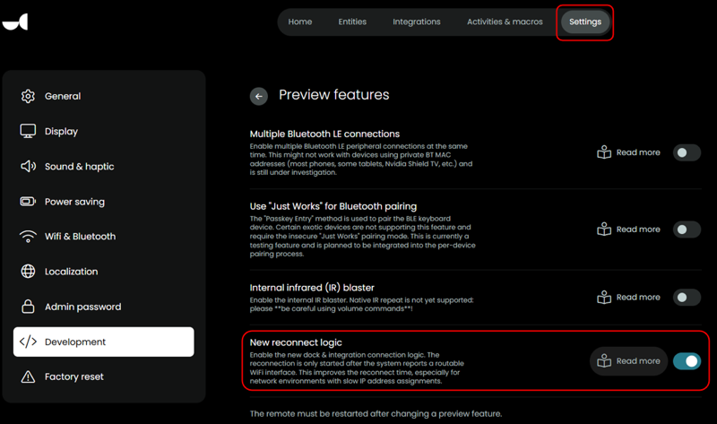

# Onkyo AVR / Pioneer AVR / Integra AVR

Custom integration for Unfolded Circle remotes to control your Onkyo / Pioneer / Integra AVR.

## ⚠️ Disclaimer ⚠️

You use this integration at your own risk!

## Prerequisites

Read this readme completely, it contains some tips for known issues and it also explains how to use `Input source` in a flexibale way so you can send a lot of different commands to your AVR.

- Your AVR(s) needs a fixed IP address.
- Your AVR(s) needs to be connected to the same network as you UC Remote (if AVR IP is 192.168.1.x then UC Remote IP must also start with 192.168.1).
- Your AVR(s) needs to be ON or STANDBY.
- A wired network connection is preferred but several users report it's working fine while AVR is connected over WiFi.
- Your AVR is configured to allow/enable control over IP/Network:
  - Network/Bluetooth > Network Standby: On
  - Miscellaneous > External Control > Network Control: On
- Your UC Remote needs to have `New reconnect logic` enabled.

  

_If your AVR has been disconnected from power, it could be that you first have to switch on your AVR manually one time before network commands work again (depends on the model), waking up after STANDBY should then work again._

## Reported to work on different brands and models

I have tested it with my Onkyo TX-RZ50. I gave it a fixed IP address (a while ago to solve Spotify hickups) and it has a wired connection to my network.

Users report it also to work with:

- TX-RZ70
- TX-RZ1100
- TX RZ-730
- TX-NR555
- TX-NR656
- TX-NR807
- TX-NR6050
- TX-NR6100
- Pioneer VSX-932
- Pioneer VSX-LX305
- Pioneer VSA-LX805
- Integra (model unknown)

## Install

[Installation](./docs/installation.md)

[Upgrade to new version](./docs/new-version.md)

[Backup and Restore](./docs/backup-restore.md)

[Migrate from pre-v.0.7.0 to v.0.7.0+](./docs/v070-migration.md)

Example activities:

- [Spotify](./docs/spotify.md)
- [AppleTV](./docs/atv.md)
- [DAB Radio](./docs/dab.md)
- [TuneIn Radio](./docs/tunein.md)
- [Tidal](./docs/tidal.md)
- [Deezer](./docs/deezer.md)
- Make sure that you add your Activities to an [Activity Group](./docs/activitygroup.md).
- `Home` \ `Customise your remote` Add your new Activity to a page and now you can give it a try on the awesome Unfolded Circle Remote!
- or, when not created an activity yet: `Home` \ `Customise your remote` and just add your AVR, in that case physical buttons are mapped.

## Album Art

[Album art](./docs/album-art.md)

## Input source and Cheats

[Input source](./docs/input-selector.md)

[Cheats](./docs/cheats.md)

## Volume

[Volume](./docs/volume.md)

[Slider](./docs/volume.md#slider)

## Sensors and Selects

[Sensors](./docs/sensor.md)

[Selects](./docs/select.md)

## Listening modes

[Listening modes](./docs/listening-modes.md)

## Multiple AVRs and Zones

[Multiple AVRs](./docs/multiple-avrs.md)

[Multiple zones](./docs/multiple-zones.md)

## Other

[Kudos](./docs/kudos.md)

[Raw messages](./docs/raw.md)

[Log level](./docs/loglevel.md)

[Collect logs](./docs/collect-logs.md)

[Known issues and solutions](./docs/known-issues.md)

[Architecture and Operation](./docs/architecture.md)
