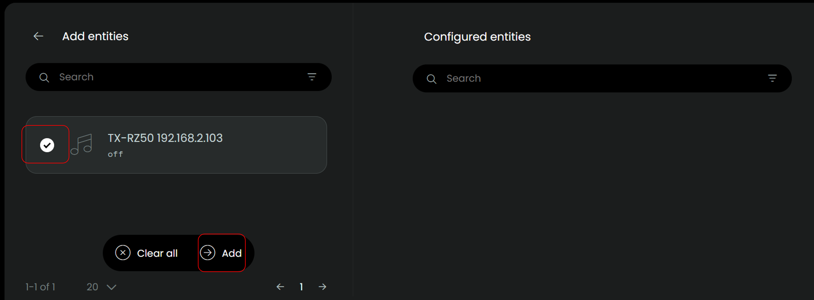
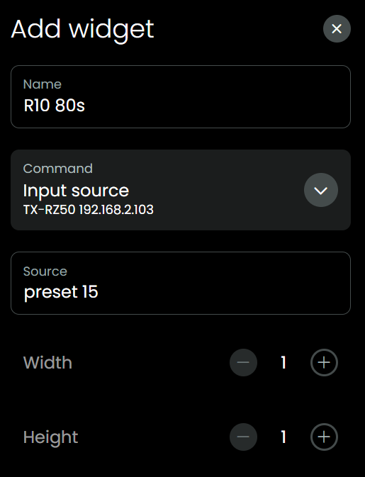
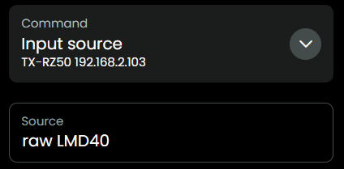

# uc-intg-onkyo-avr

Onkyo AVR custom integration for Unfolded Circle remotes.

## Kudos

This integration has been made possible by:

- [unfoldedcircle/integration-ts-example](https://github.com/unfoldedcircle/integration-ts-example):
  - A good starting point for building your own integration in TypeScript.
- [miracle2k/onkyo-eiscp](https://github.com/miracle2k/onkyo-eiscp):
  - Python project to communicate over a network with an Onkyo AVR.
  - Contains an impressive JSON file with all kinds of commands and the translation between human-readable and eISCP messages.
  - That JSON even contains the set of commands available _per zone, per model_, which is very thorough but that also means al lot to maintain which I would not like to do. So I removed the elements that check if a command is allowed for a zone/model. Just check the manual of your device to see what your device is capable of. So the JSON in this integration project is smaller and might even shrink some more in time.
- [estbeetoo/eiscp.js](https://github.com/estbeetoo/eiscp.js/):
  - JavaScript project to communicate over a network with an Onkyo AVR.
  - uc-intg-onkyo-avr contains a TypeScript version (thank you GitHub Copilot) of the pieces of code it could use from estbeetoo/eiscp.js, which was a lot.
- [integration-roon](https://github.com/unfoldedcircle/integration-roon):
  - TypeScript project helped to get more insights in what is needed to create a custom-integration.
- [JackJPowell/uc-intg-yamaha-avr](https://github.com/JackJPowell/uc-intg-yamaha-avr):
  - To see what uc-intg-onkyo-avr integration is missing :)
- [mase1981](https://github.com/mase1981): for helping out when I got stuck packaging this first version.
- [harvey28](https://unfolded.community/u/harvey28/summary): for testing and feedback.

## Prerequisites

Read this readme completely, it contains some tips for known issues and it also explains how to use `Input source` in a flexibale way so you can send a lot of different commands to your AVR.

Your Onkyo AVR needs to be ON or STANDBY, if it is disconnected from power (off) this integration will fail. If your AVR has been disconnected from power, it could be that you first have to switch on your AVR manually one time before network commands work again (depends on the model), waking up after STANDBY should then work again.

This integration can only work well when there is just one AVR in the network.

## Reported to work on different brands and models

I have tested it with my Onkyo TX-RZ50. I gave it a fixed IP address (a while ago to solve Spotify hickups) and it has a wired connection to my network.

Users report it also to work with:

- TX-RZ70
- TX-NR656
- TX-NR807
- TX-NR6100
- Pioneer VSX-932
- Integra (model unknown)

## Known issues and solutions

### In case of issues during the 'on requence' of an Activity

Some AVR models temporarily disconnect when powering on, in that case the next command that the Remote tries to send ends up in an error or time out because the Remote cannot re-connect yet. If you encounter that kind of issue, add a delay step between the Switch ON and the next AVR command of approximately 5 seconds, then lower it and try again to find the sweet spot:

### In case the AVR overshoots on long-press

When you long-press a button, for example volume up, and the AVR overshoots then increase the `Long Press Threshold` in the setup step of this integration. The setup step can be run again and again by selecting the integration in de webconfigurator of the Remote.

Just assign the volume command to the short-press in webconfigurator, **don't** assign to long-press.

## Installation and usage

- Make sure your AVR is ON or STANDBY.
- Download `uc-intg-onkyo-avr-x.x.x.tar.gz` from this page.
- In webconfigurator, go to `Integrations`, `Add new`, `Install custom`, select the `uc-intg-onkyo-avr-x.x.x.tar.gz` and then `Upload`.
- Uploading can take a few seconds.
- For the next step, it depends on your AVR model if it supports autodiscover, if it does:
  - In `Integrations` select `Onkyo AVR custom`.
  - Leave the input fields `AVR Model` and `AVR IP Address` empty.
  - Check if the endpoint for Album Art corresponds with your AVR model, if it does not have an Album Art endpoint, set it to `na` to prevent errors.
  - Click `Next`, click `Done`.
- If auto discover fails, remove the integration completely, upload it again and then after upload:
  - In `Integrations` select `Onkyo AVR custom`.
  - Populate `AVR Model` and `AVR IP Address`.
  - Check if the endpoint for Album Art corresponds with your AVR model, if it does not have an Album Art endpoint, set it to `na` to prevent errors.
  - Click `Next`, click `Done`.
- Add your AVR as entity: In `Integrations` select `Onkyo AVR custom`, click the `+` next to `Configured entities`, add your AVR

  

  

- In webconfigurator, go to `Activities & macros`
- Add new Activity
- Give it a name, `Next`, Select your AVR, `Done`
- In the new Activity, `Sequences`, assign the corresponding commands to the `On sequence` and `Off sequence`

  

- In the new Activity, `Button mapping`, assign some buttons: `mute`, `volume up/down`, `channel up/down`
- Also available: `settings`, `cursor left right up down enter` and `home` to go back one level in the settings menu, `settings` you could assign to to the (hamburger) `menu` physical button on the remote and `home` you could for example assign to the `record` physical button next to it.

## Album Art

- During setup the endpoint for album art is set.
- If for example the endpoint of your AVR is "http://192.168.2.103/album_art.cgi" then the value for endpoint in the setup is `album_art.cgi`.

  

- The album art endpoint is used for specific cases, for example when you listen to Spotify.
- Album art is refreshed every 5 seconds.
- **If your AVR does not have an endpoint for Album Art, set the value to `na` to prevent errors.**

  

## Spotify

Let's say that you select the AVR in the Spotify app on your phone and your AVR switches source to Spotify, the remote will sense that and will try to collect the album art, artist, title and album. All this is collected from the AVR, this integration does not communicate with Spotify directly. Also `play/pause`, `next` and `previous` will be send to the AVR, the AVR will handle the communicatio with your Spotify app.

## Cheats

In the new Activity, `User interface`, add `Text Button` and select `Input source`, because there is a text field where you can type anything, we can give all kinds of commands, like presets or input sources:

- As the code uses the impressive JSON mentioned in the Kudos section, you can cheat a bit with it to give commands which are mentioned in the JSON. For example in the [JSON](./src/eiscp-commands.json) is mentioned `dimmer-level` with possible value `dim`, let's give it a try: yes the AVR display dims to the next level!

  

## Remote

- `Home` \ `Customise your remote` Add your new Activity to a page and now you can give it a try on the awesome Unfolded Circle Remote!

- or, when not created an activity yet: `Home` \ `Customise your remote` and just add your AVR, in that case physical buttons are mapped.

## Volume

The AVR itself may display the volume as dB (relative) or as an absolute number, depending on its settings, but the eISCP protocol only accepts and returns the absolute value. There is no command to set the volume directly in dB via eISCP.

## Listening modes

Like descibed in the Cheats section, you can send a lot of different commands which are all mentioned in the [JSON](./src/eiscp-commands.json) file.

Probably you have your AVR set to automatically select the best listening mode, but sometimes you might want to set a favorite mode, see the listening-mode section in the [JSON](./src/eiscp-commands.json), for the correct command. A few examples from that JSON:

| Listening mode                      | value in `Input source`                            |
| ----------------------------------- | -------------------------------------------------- |
| Stereo                              | listening-mode stereo                              |
| Straight Decode                     | listening-mode straight-decode                     |
| Neo:6/Neo:X THX Cinema              | listening-mode thx-cinema                          |
| Neo:6 Cinema DTS Surround Sensation | listening-mode neo-6-cinema-dts-surround-sensation |

## But what about the more modern stuff like `Dolby Atmos`, `DTS:X`, `Auro-3D`, `IMAX Enhanced`?

eISCP codes for Atmos, DTS:X, Auro-3D, and IMAX Enhanced are not standardized and may vary by receiver model and firmware.

However, most models `auto-select` the correct mode when the input signal is `Dolby Atmos`, `DTS:X`, `Auro-3D`, `IMAX Enhanced` and the listening mode is set to `Straight Decode`.

| Listening mode | value in `Input source`        |
| -------------- | ------------------------------ |
| Dolby Atmos    | listening-mode straight-decode |
| DTS:X          | listening-mode straight-decode |
| Auro-3D        | listening-mode straight-decode |
| IMAX Enhanced  | listening-mode straight-decode |

## Raw messages

This integration aims to use human readable commands, like `listening-mode straight-decode`. But let's say you have figured out a command for your AVR that does not exist yet in the JSON, then you can try to send it in raw format:

Please let me know in [Discord](https://discord.com/channels/553671366411288576/1405962064521855127) what commands you have found, I will try to add them to this integration.

## Stuff to do / backlog

- Align and improve logging.
- Refactor the code for easier debugging.
- The code is partly ready to deal with different zones, but that still needs some attention before that will actually work.
