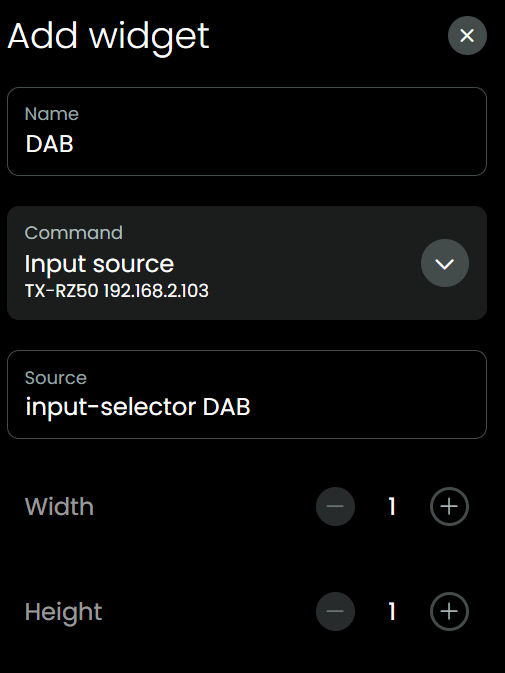
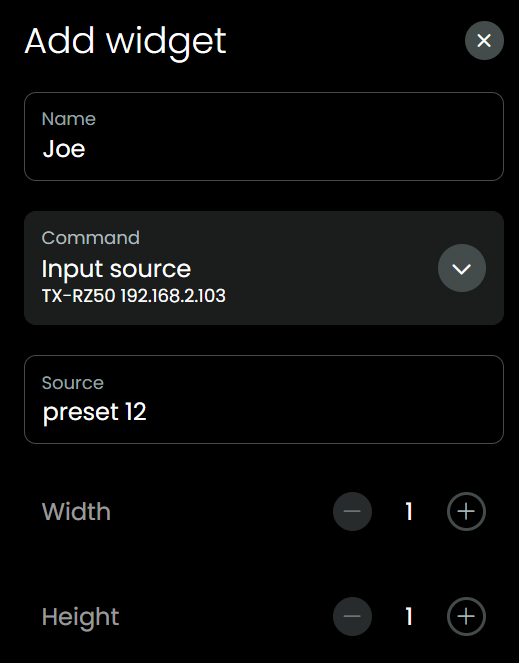

# uc-intg-onkyo-avr

Onkyo AVR custom integration for Unfolded Circle remotes.

## Kudos

This integration has been made possible by:

- [unfoldedcircle/integration-ts-example](https://github.com/unfoldedcircle/integration-ts-example):
  - a good starting point for building your own integration in TypeScript
- [miracle2k/onkyo-eiscp](https://github.com/miracle2k/onkyo-eiscp):
  - Python project to communicate over a network with an Onkyo AVR.
  - Sontains an impressive JSON file with all kinds of commands and the translation between human-readable and eISCP messages.
  - That JSON even containes the set of commands available _per zone, per model_, which is very thorough but that also means al lot to maintain which I would not like to do. So I removed the filters that check if a command is allowed for a zone/model. Just check the manual of your device to see what your device is capable of. So the JSON in this integration project is smaller and might even shrink some more in time.
- [estbeetoo/eiscp.js](https://github.com/estbeetoo/eiscp.js/):
  - JavaScript project to communicate over a network with an Onkyo AVR.
  - uc-intg-onkyo-avr contains a TypeScript version (thank you GitHub Copilot) of the pieces of code it could use, which was a lot.
- [integration-roon](https://github.com/unfoldedcircle/integration-roon):
  - This TypeScript project helped to get more insights in what is needed to create a custom-integration.
- [JackJPowell/uc-intg-yamaha-avr](https://github.com/JackJPowell/uc-intg-yamaha-avr):
  - To see what this Onkyo-AVR integration is missing :)
- [mase1981](https://github.com/mase1981): for helping out when I got stuck packaging this first version.

## This is not yet good enough to replace whatever you currently have configured for you Onkyo AVR

Although this integration can be installed on Unfolded Circle remotes, I would not right away use it as replacement for your current setup because this is just the first version where 'something works' and I expect a bug or two somehwere.

**Breaking changes are expected.**

It can be nice though to install it an play with it, just to see if it is working for your specific Onkyo model, if you decide to do so please first create a backup of your remote.

## Prerequisites

- Your Onkyo AVR needs to be ON or STANDBY, if it is disconnected from power (off) this integration will fail.

## It works on my machine

I have tested it with my Onkyo TZ-RZ50. I gave it a fixed IP address (a while ago to solve Spotify hickups) and it has a wired connection to my network.

I only have one AVR, I don't know what happens yet when you have multiple Onkyo AVRs in your network.

The code is partly ready to deal with different zones, but that does still need a lot of attention before that will actually work.

## Installation and usage

- Make sure your AVR is ON or STANDBY.
- Download `uc-intg-onkyo-avr-0.0.1.tar.gz` from //////////
- In webconfigurator, go to `Integrations`, `Add new`, `Install custom`, select the `uc-intg-onkyo-avr-0.0.1.tar.gz` and then `Upload`.
- Uploading can take a few seconds.
- In `Integrations` select `Onkyo AVR custom`, click `Next`, click `Done`
- In `Integrations` select `Onkyo AVR custom`, click the `+` next to `Configured entities`, add your AVR

  

  

- In webconfigurator, go to `Activities & macros`
- Add new Activity
- Give it a name, `Next`, Select your AVR, `Done`
- In the Activity, `Sequences`, assign the corresponding commands to the `On sequence` and `Off sequence`

  

- In the Activity, `Button mapping`, assign some buttons: `mute`, `volume up/down`, `channel up/down`

## Cheats

- In the Activity, `User interface`, add `Media Widget` and select your AVR: it will for now just show some basic info, I did that to be able to right away see a change done directly on the AVR, like changing volume, back on the remote without checking logs. So this is temporary for checking the 2-way communication.
- In the Activity, `User interface`, add `Text BUtton` and select `Input source`, because there is a text field where you can type anything, we can give all kinds of commands, like presets or input sources:

  

  

  

  

- As the code uses the impressive JSON mentioned in the Kudos section, you can cheat already a bit with it to give commands which are not even known by the driver. For example in the JSON is mentioned `dimmer-level` with possible value `query`, let's give it a try:

  

  In the logs you will see ``.
If you would change it into `dimmer-level dim` you would see the display dim to the next level.

## Remote

- `Home` \ `Customise your remote` Add your Activity to a page and now you can give it a try!

  
