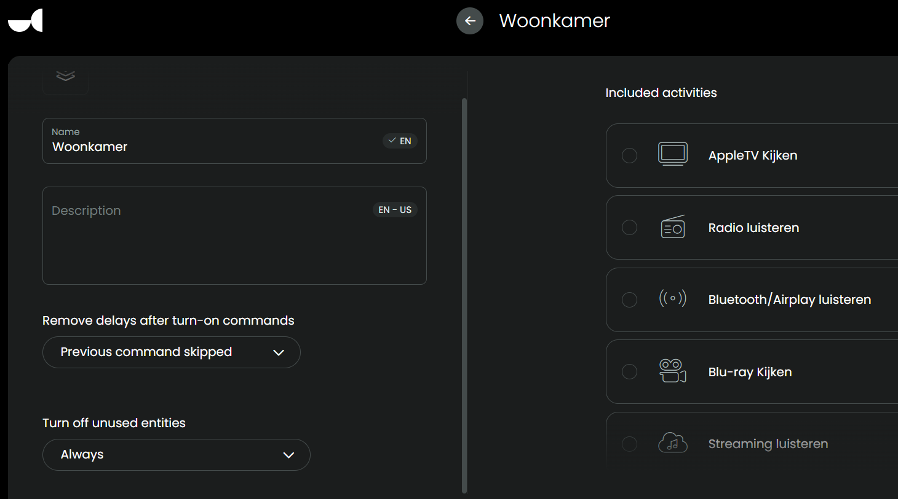

## Activity Group

[back to main README](../README.md#example-activities)

Make sure that you add your Activities to an Activity Group so when you switch from one to another the AVR will not be set to standby and then powered on again:

[back to main README](../README.md#example-activities)