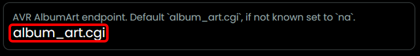
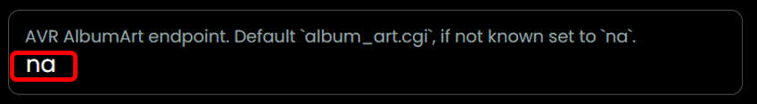

## Album Art

- During setup the endpoint for album art is set.
- If for example the endpoint of your AVR is "http://192.168.2.103/album_art.cgi" then the value for endpoint in the setup is `album_art.cgi`.

  

- The album art endpoint is used for specific cases, for example when you listen to Spotify.
- **If your AVR does not have an endpoint for Album Art, set the value to `na` to prevent errors.**

  

*note: after installing a new version of the integration or after a reboot of the remote, it might be needed to close screen on the remote and enter the already active activity again to get the MediaWidget to work, hit next to go to the next song and trigger refresh of the album art*

  [back to main README](../README.md#album-art)
