# Architecture and Operation

This document describes the generic architecture and operational model of the Onkyo/Pioneer/Integra AVR integration for Unfolded Circle remotes.

## Overview

This integration uses an **event-based bidirectional communication model** with your AVR. Commands are sent to the AVR, and the AVR responds with state updates that are processed asynchronously. The AVR also sends unsolicited state updates when changes occur locally (e.g., volume adjusted on the physical remote or front panel).

## Communication Protocol

The integration uses **eISCP (Ethernet Integrated Serial Control Protocol)**, which is Onkyo's proprietary network protocol for controlling their AVRs over TCP/IP.

- **Protocol**: eISCP over TCP
- **Port**: 60128 (default)
- **Connection**: Persistent TCP socket connection
- **Format**: Text-based command/response protocol

## Component Diagram



<!-- Diagram source: docs/architecture.mmd — regenerate with: npm run generate-diagram -->

## Architecture Components

### 1. Entry Point

**OnkyoDriver** (`src/driver.ts`)

- Top-level class; instantiated once by `index.ts`
- Owns the Unfolded Circle `IntegrationAPI` instance and reacts to platform events (`Connect`, `EnterStandby`, `ExitStandby`)
- Delegates setup UI flow to `SetupHandler`; delegates connection orchestration to `ConnectCoordinator`
- Registers entities via the `buildEntityRegistrations` / `registerAvailableEntities` OCP pattern (see below)
- Does **not** contain connection or session logic directly — each concern lives in its own module

### 2. Connection Layer

**ConnectCoordinator** (`src/connectCoordinator.ts`)

- Orchestrates the full connect sequence: creates/refreshes physical connections, creates zone instances, and triggers initial state queries
- Called from `handleConnect()` on every `Connect` and `ExitStandby` event
- Runs in three steps:
  1. **Physical connections** — for each unique AVR IP, either create a new connection (`ConnectionManager.createAndConnect`) or refresh config and reconnect if the existing TCP socket is lost
  2. **Zone instances** — for each configured zone, delegate to `AvrInstanceManager.ensureZoneInstances`
  3. **State queries** — for each newly connected zone, call `queryAvrState` (skipping zones already queried during reconnection in step 1)

**ConnectionManager** (`src/connectionManager.ts`)

- Manages a map of `PhysicalConnection` objects — one per unique AVR IP
- Each `PhysicalConnection` holds: an `EiscpDriver` (TCP socket), a `CommandReceiver` (event listener), and the stored `AvrConfig`
- `createAndConnect` — creates the `EiscpDriver`, wires up the `CommandReceiver`, opens TCP socket; schedules reconnection on failure
- `updateConnectionConfig` — patches a live connection's runtime settings (send delay, zones, tuner preset position) without disconnecting
- `scheduleReconnect` / `cancelScheduledReconnection` — delegates to `ReconnectionManager`

**ReconnectionManager** (`src/reconnectionManager.ts`)

- Implements progressive retry logic (configurable timeouts: 3 s, 5 s, 8 s)
- Supports scheduled reconnections (default 30 s delay) and immediate cancellation

**AvrInstanceManager** (`src/avrInstanceManager.ts`)

- Manages zone-level `AvrInstance` objects — one per `{model}_{host}_{zone}` entity
- Each instance holds the zone `AvrConfig` and its `CommandSender`
- `ensureZoneInstances` — creates a new instance if absent; refreshes config on existing ones

**EiscpDriver** (`src/eiscp.ts`)

- Low-level TCP/UDP transport using Node.js `net`/`dgram` modules
- Manages send and receive queues with configurable delays to prevent overwhelming the AVR
- Handles UDP broadcast discovery
- Emits `'data'` events when messages are received from the AVR
- Delegates packet encoding/decoding to `eiscp-packet.ts` and command parsing to `IscpCommandParser`

**eiscp-packet.ts** (pure functions)

- `createEiscpPacket` — wraps an ISCP command string in a binary eISCP frame for sending
- `extractIscpMessage` / `extractAllIscpMessages` — extracts one or more ISCP messages from a received TCP buffer

**IscpCommandParser** (`src/eiscp-command-parser.ts`)

- Owns all ISCP command parsing logic, zone detection, and reverse command mapping
- Translates raw `command + value` strings into structured `CommandResult` objects
- Maintains metadata state (title/artist/album) via `patchMetadata` / `getMetadata`

**eiscp-multi-zone.ts** (pure functions)

- `buildMultiZoneVolumeCommands` / `buildMultiZoneMuteCommands` — build batched zone command lists from a single multi-zone action string (e.g. `"all-up"`, `"main-zone2-toggle"`)

### 3. Command Flow (Outbound)

**CommandSender** (`src/commandSender.ts`)

- Receives commands from the Unfolded Circle integration API via `sharedCmdHandler`
- Translates high-level media player commands (e.g., `VolumeUp`) into eISCP protocol commands
- Routes commands to the appropriate zone (main, zone2, zone3)
- Verifies connection state before sending; retries once with reconnect if disconnected

**Flow Example — Volume Up:**

```

User presses Volume Up on remote
↓
Unfolded Circle Integration API calls entity command
↓
OnkyoDriver.sharedCmdHandler() → CommandSender.sharedCmdHandler()
↓
CommandSender calls eiscp.command("volume level-up-1db-step")
↓
EiscpDriver formats command to eISCP: "MVLUP1"
↓
EiscpDriver sends packet over TCP socket to AVR
↓
AVR adjusts volume and sends back a volume state update

```

### 4. Event Flow (Inbound)

**CommandReceiver** (`src/commandReceiver.ts`)

- Listens to `'data'` events emitted by the `EiscpDriver`
- Routes incoming messages to handlers based on command type
- Translates eISCP responses into Unfolded Circle entity attribute updates (volume, source, power, sensors…)
- For zone-agnostic commands (FLD, NLT, IFA, DSN, NST, NLS, NLA, NTM, metadata), delegates to `ZoneAgnosticUpdateProcessor`

**ZoneAgnosticUpdateProcessor** (`src/zoneAgnosticUpdateProcessor.ts`)

- Handles commands where the correct target zone(s) must be determined at runtime rather than from the incoming event's zone field
- Fans out FLD (front panel display), NLT (service name), metadata, and similar events to all relevant zones on the same physical AVR
- For NET zones: updates the front panel display sensor and detects sub-source changes (Spotify, TuneIn, Tidal…)
- For FM zones: updates both the media player station/artist and the front panel display sensor

**Flow Example — Volume Update:**

```

AVR volume changes (from any source: network command, IR remote, front panel)
↓
AVR broadcasts: "MVL32" (volume = 32)
↓
EiscpDriver receives packet, parses it, emits 'data' event
↓
CommandReceiver processes volume command:

- Converts protocol value → display value (÷2 for 0.5 dB steps if enabled)
- Updates media player volume attribute and volume sensor entity
  ↓
  Unfolded Circle remote UI updates

```

### 5. State Management

**AvrStateManager** (`src/avrState.ts`)

- Centralized, per-zone state tracking: power, source, sub-source, volume, audio format, playback status
- Enables context-dependent parsing (e.g., same FLD message means different things for FM vs. NET)
- When source changes, triggers `setSource` which calls `queryAvrState` for the zone

**AvrStateQueryService** (`src/avrStateQuery.ts`)

- Sends the full set of ISCP query commands for a zone (power, input-selector, volume, audio-info, video-info, fp-display…)
- Includes a 5-second debounce guard per entity to prevent redundant queries from multiple events firing in quick succession

### 6. Entity Registration — OCP Pattern

Entity types are defined as `EntityRegistration` descriptors in `buildEntityRegistrations()`:

```

EntityRegistration {
enabled(cfg) → boolean // whether to register for this AVR
create() → Entity[] // build the entity/entities
afterRegister() → void // optional post-registration hook
}

```

`registerAvailableEntities()` iterates this list without knowing entity types. To add a new entity type, append a descriptor — the loop never changes.

Current registrations (in order):

1. **Media player** — always registered
2. **Sensor entities** — conditional on `createSensors` flag (volume, source, audio/video format, front panel display…)
3. **Listening Mode select** — conditional on `listeningModeOptions` not being `null`
4. **Input Selector select** — conditional on `inputSelectorOptions` not being `null`

### 7. Specialist Handlers

**SetupHandler** (`src/setupHandler.ts`) — setup UI flow (manual config, auto-discovery, backup/restore)

**ListeningModeHandler** (`src/listeningModeHandler.ts`) — handles select-entity commands for listening mode

**InputSelectorHandler** (`src/inputSelectorHandler.ts`) — handles select-entity commands for input selector

**SubscriptionHandler** (`src/subscriptionHandler.ts`) — handles entity subscribe/unsubscribe events; queries state for newly subscribed entities

## Event-Based Model

### Unsolicited Updates

The AVR sends state updates whenever its state changes, regardless of whether the integration sent a command:

- Volume adjusted on physical remote → AVR sends volume update
- Input changed on front panel → AVR sends input-selector update
- Track info changes during streaming → AVR sends metadata updates
- Power state changes → AVR sends system-power update

### Asynchronous Command-Response Pattern

When you send a command:

1. The command is sent immediately (non-blocking)
2. The AVR processes the command
3. The AVR sends back one or more state update events
4. `CommandReceiver` processes these events asynchronously
5. Entity attributes are updated in the UI

This differs from a synchronous request-response model where you would wait for a specific response after each command.

### Multiple Updates from Single Command

A single command can trigger multiple event messages:

- Changing input might trigger: `input-selector`, `audio-information`, `video-information`, `listening-mode`, `volume`
- Playing a network service triggers: service name (NLT), title, artist, album, artwork

### Streaming Data

Some information arrives as fragmented streams:

- Album art URL changes
- Metadata updates (title/artist/album) arrive as separate events
- Display text may arrive in multiple FLD (front panel display) messages

## Zone Architecture

**Single Physical AVR, Multiple Zones:**

- One TCP connection per physical AVR (one `EiscpDriver`, one `CommandReceiver`)
- Each zone (main, zone2, zone3) is a separate media player entity with its own `CommandSender`
- Commands are prefixed with the zone identifier before sending to the AVR
- Incoming events include a zone field; zone-agnostic commands are fanned out by `ZoneAgnosticUpdateProcessor`

**Multiple Physical AVRs:**

- Each AVR gets its own TCP connection, shared by all configured zones on that AVR
- Entities are uniquely identified: `{model}_{host}_{zone}`

## Error Handling and Resilience

### Connection Management

- **Auto-reconnection**: `ReconnectionManager` handles dropped connections with progressive timeouts (3 s, 5 s, 8 s) then a 30 s scheduled retry
- **Reconnect on command**: Commands sent while disconnected trigger an immediate reconnection attempt
- **Graceful degradation**: Entities remain registered during disconnection
- **Config refresh without disconnect**: `updateConnectionConfig` pushes new runtime settings to a live connection

### State Synchronization

- **Query on connect**: Full state query sent when a connection is established or re-established
- **Query on wake**: State refreshed when the remote exits standby
- **Debounced queries**: `AvrStateQueryService` prevents redundant queries within a 5 s window

### Message Processing

- **Queue management**: Send and receive queues prevent overwhelming the AVR
- **Throttling**: High-frequency commands (IFA, IFV, FLD) go through the receive queue
- **Filtering**: Volume-overlay FLD messages and known-noisy commands (NMS, NPB) are discarded early
- **Validation**: Unknown or malformed messages are safely ignored

## Command Mapping

**eiscpCommands** (`src/eiscp-commands.ts`)

- Human-readable command names → eISCP protocol codes
- E.g., `"system-power on"` → `"PWR01"`

**eiscpMappings** (`src/eiscp-mappings.ts`)

- Protocol values → human-readable values
- E.g., `"SLI10"` → `{ command: "input-selector", value: "dvd" }`

## Performance Considerations

### Queue Thresholds

- **Send delay** (`queueThreshold`): Minimum time between outgoing commands (default 100 ms). Configurable per AVR. Critical for rapid commands (volume, cursor navigation).

- **Receive delay** (`receive_delay`): Throttle for low-priority incoming messages (default 100 ms). Applied only to throttled commands (IFA, IFV, FLD) via the receive queue.

### Optimization Strategies

- **Message filtering**: Display scrolling and noise messages dropped at the `EiscpDriver` level before command handlers run
- **Conditional processing**: Context-aware parsing — same command is interpreted differently depending on current source
- **Buffered metadata**: Title/artist/album accumulated before updating UI
- **Zone fanout**: `ZoneAgnosticUpdateProcessor` resolves the correct target zones at event time, avoiding duplicate TCP round-trips

## Debugging and Logging

The integration logs extensively to help troubleshoot issues:

- **Connection events**: Connect, disconnect, reconnect attempts
- **Command send**: All outgoing commands with entity ID and parameters
- **State updates**: All meaningful state changes with old/new values
- **Error conditions**: Connection failures, command timeouts, parsing errors

Log statements use entity ID prefix (`{model} {host} {zone}`) for multi-AVR/multi-zone identification.

```

```
