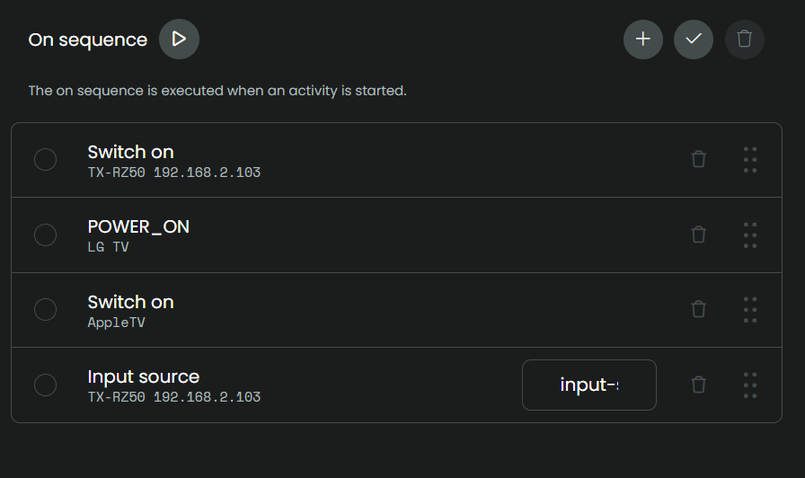

## Apple TV

[back to main README](../README.md#example-activities)

### Apple TV activity

To set up an Activity for AppleTV, have a look at these screenshots:

- Create activity and prevent sleep

  

- On sequence, Input source: `input-selector stm` (or whatever input you have assigned in your AVR for Apple TV)

  

- User inerface, add mediawidget for the AVR with maximum size

  

- Button mapping, map to the buttons you prefer:
  - volume up/down
  - play/pause
  - rewind/fastforward
  - mute

[back to main README](../README.md#example-activities)