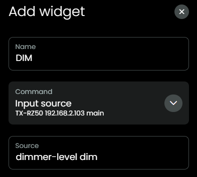

## Cheats

## Simple commands

As from v0.9.0 this integration creates a list of `simple commands` (like PRESET_15, DIRAC_SLOT1, LISTENING_MODE_STEREO, INPUT_FM) which are available for you in Web Configurator.

## Text commands

If you cannot find a command but you see that command in the JSON, you can send it as text command.

In an Activity goto `User interface`, add `Text Button` and select `Input source`, because there is a text field where you can type anything, we can give all kinds of commands, like presets or input sources.

Based on how you configured the [Input Select](./select-input-selector.md), the `Input source` will show a dropdown, you can however still enter commands instead of selecting an option from dropdown. For example in the [JSON](../src/eiscp-commands.ts) is mentioned `dimmer-level` with possible value `dim`, let's give it a try: yes the AVR display dims to the next level!

## Raw commands

If the command you want to send is not yet mentioned in the JSON but you do know the details you can still send it as [raw command](./raw.md).
