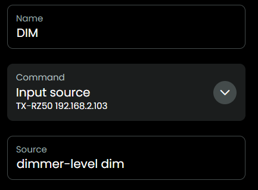

## Cheats

[back to main README](../README.md#cheats)

In the new Activity, `User interface`, add `Text Button` and select `Input source`, because there is a text field where you can type anything, we can give all kinds of commands, like presets or input sources:

- As the code uses the impressive JSON mentioned in the Kudos section, you can cheat a bit with it to give commands which are mentioned in the JSON. For example in the [JSON](./src/eiscp-commands.ts) is mentioned `dimmer-level` with possible value `dim`, let's give it a try: yes the AVR display dims to the next level!

  

[back to main README](../README.md#cheats)
