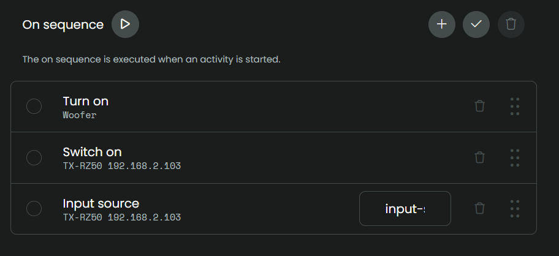
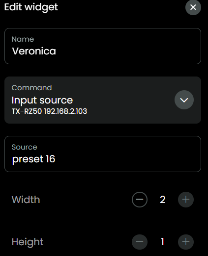

## DAB Radio

[back to main README](../README.md#example-activities)

### DAB Radio activity

To set up an Activity for DAB, have a look at these screenshots:

- Create activity and prevent sleep

  

- On sequence, Input source: `input-selector dab`.

  

- User interface, add mediawidget for the AVR: 

  

- User interface add some presets for example:

  

- User interface:

  

- Button mapping, map to the buttons you prefer:
  - volume up/down
  - channel up/down
  - mute

[back to main README](../README.md#example-activities)