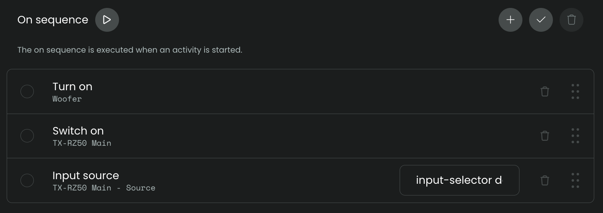
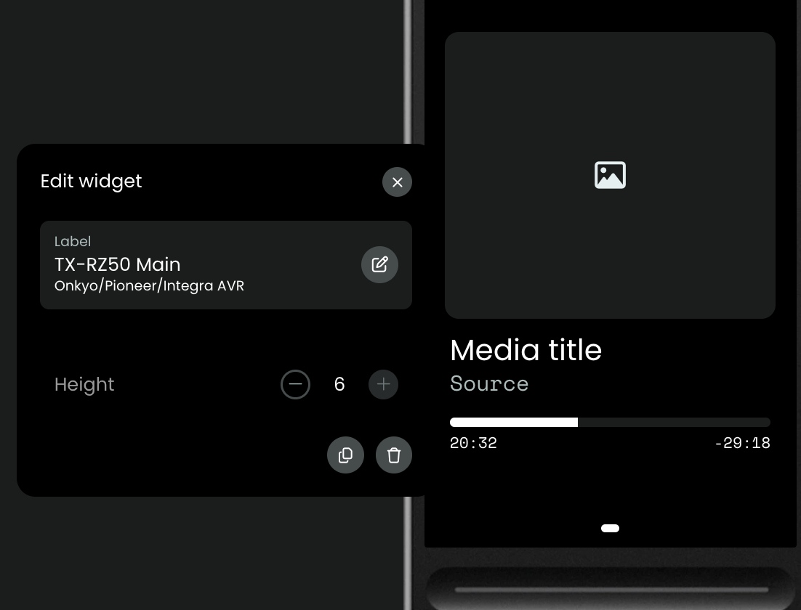
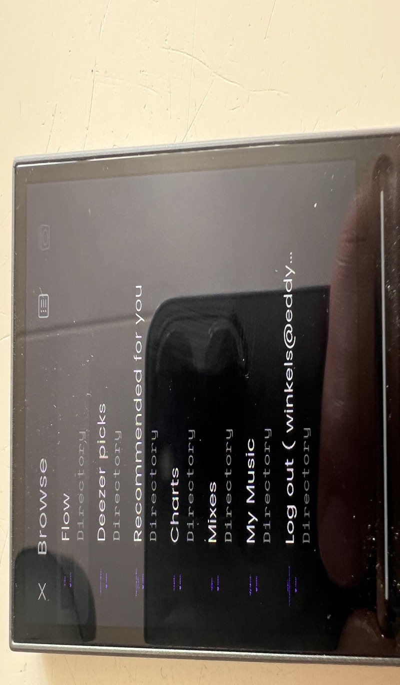
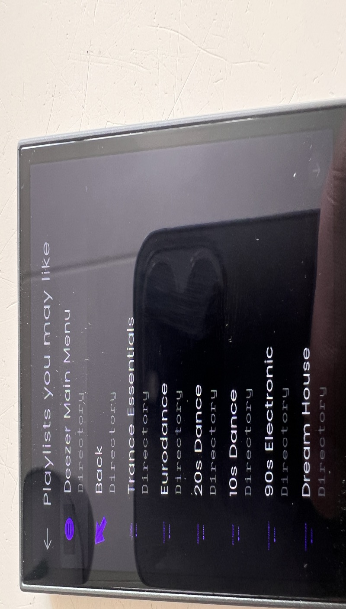
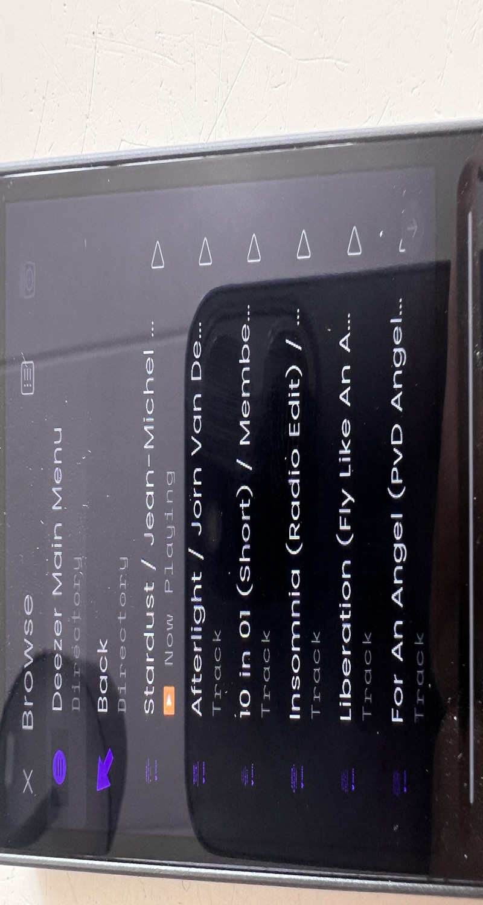

## Deezer

As your AVR can logon to Deezer with your account, the integration can be used to browse the Deezer menu.

This integration will try to collect the album art, artist, title and album. All this is collected from the AVR, this integration does not communicate with Deezer directly. All commands, like `browse`, `play/pause`, `next` and `previous`, will be send to the AVR, the AVR will handle the communication with the Deezer service.

### Prerequisite: Add your Deezer account to the AVR

Use the AVR menu/settings or _Controller app of your AVR_ to logon to Deezer, in a similar way as described for [Tidal](./tidal.md).

### Deezer activity

To set up an Activity for Deezer, have a look at these screenshots:

- Create activity and prevent sleep

  

- On sequence, Input source: `input-selector deezer`

  

- User interface, add mediawidget for the AVR with maximum size

  

- Button mapping: map to the buttons you prefer (for example previous/next can be mapped to channel up/down):
  - volume up/down
  - play/pause
  - previous/next
  - mute

    

Commands on the remote will only work if you can also use those commands directly in your Deezer app, that depends on the subscription you have for Deezer.

### Change setting directly on the Unfolded Circle Remote

It's recommended to _disable_ the setting `Coverflow in media browser` to get the best experience for navigating the Deezer menu through this integration. To do so, click in the top right corner of the screen on the remote, select Settings > User Interface > Coverflow in media browser: off.

### Browse Deezer

The mediabrowser of Unfolded Circle combined with your AVR being logged on to the Deezer service make it possibe to scroll through the Deezer menu just like you would do with the Controller app of your AVR or navigating the menu on you AVR using your TV.

The menu options can differ from the options of the Deezer app on your phone, they will match with what the app of your AVR offers you.

Some screenshots:

**When you want to go back in menu options, it's best to use `Deezer Main Menu` or `Back` at the top of the options, the back button in the Media Browser itself does not yet set the AVR state one step back in menu navigation so you could get into unexpected behavior using the back option of the Media Browser.**

### Note

If `input-selector deezer` does not work, check the manual of your AVR to see if Deezer is even available as selectable input on the AVR:

- your AVR _does_ have a Deezer input: run setup of this integration again and increase the value for 'NET sub-source selection delay'
- your AVR does _not_ have a Deezer input, this setup is not possible, in that case you can use the Deezer app on your phone and if the Deezer app allows then send music to your AVR using Bluetooth, Airplay or ChromeCast
