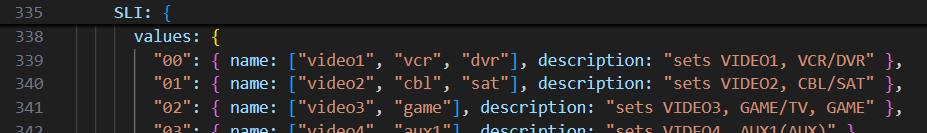

## Input source

When creating an activity, you probably also want to be able to change the input source on your AVR. As this integration uses the flexibility of the `Input source` command to be able to control almost everything, there is no dropdown available. Instead you type the command you want to send. 

All commands can be found in [this JSON](../src/eiscp-commands.ts), from there you can determine how to select the correct input.

Some examples to explain how to interpret that list:
| I want to select on AVR | value(s) in JSON           | value to enter into `Input source` |
|-------------------------|----------------------------|------------------------------------|
| CBL/SAT                 | `video2` or `cbl` or `sat` | input-selector cbl                 |
| BD/DVD                  | `bd` or `dvd`              | input-selector bd                  |
| STMBOX                  | `stm`                      | input-selector stm                 |
| TV                      | `tv`                       | input-selector tv                  |
| GAME                    | `video3` or `game`         | input-selector game                |
| NET                     | `net` or `network`         | input-selector net                 |

`NET` covers multiple options, for example streaming Spotify to your AVR. So when you want to stream Spotify/Tidal/... you can use `input-selector net` and then hit play on your Spotify app. Later on, when you select your Spotify activity again and hit play on the remote, the AVR will try to continue where you left it last time it was playing from NET.

[back to main README](../README.md#input-source)

[more on how to send different commands through `Input source`](./cheats.md)

[activities examples](../README.md#example-activities)