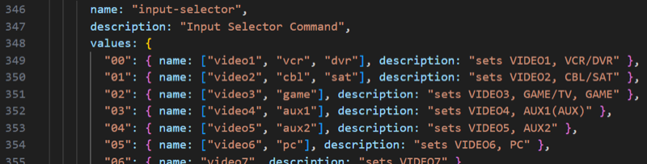

## Input source

### Select source from dropdown

This integration uses the flexibility of the `Input source` command to be able to control almost everything, so there is a dropdown available (based on your config) and next to that you can type commands instead of using the dropdown.

Depending on how you configured [Input Select](./select-input-selector.md) the integration will show a list of input sources in a drop down.

### Text input instead of dropdown

The `Input Source` also accepts text input,
All commands can be found in [this JSON](../src/eiscp-commands.ts), from there you can determine how to select the correct input.

Some examples to explain how to interpret that list:

| I want to select on AVR | Value(s) in JSON ('name')  | Value to enter into `Input source` |
| ----------------------- | -------------------------- | ---------------------------------- |
| CBL/SAT                 | `video2` or `cbl` or `sat` | `input-selector cbl`               |
| BD/DVD                  | `bd` or `dvd`              | `input-selector bd`                |
| STMBOX                  | `stm`                      | `input-selector stm`               |
| TV                      | `tv`                       | `input-selector tv`                |
| GAME                    | `video3` or `game`         | `input-selector game`              |
| NET                     | `net` or `network`         | `input-selector net`               |

### NET

`NET` covers multiple options, for example streaming Spotify/Deezer/Tidal to your AVR. So when you want to stream Spotify/Tidal/... you can use `input-selector net` and then hit play on your Spotify/Deezer app and select your AVR. Later on, when you select your NET activity again and hit play on the remote, the AVR will try to continue where you left it last time it was playing from NET.

### Select Spotify/Deezer/... directly

As from v0.7.3 you can select the 'sub-sources'of `NET` directly, let's say you want the AVR to switch to TuneIn, you can send `input-selector tunein` and the integration will make sure that _first_ the command is send to switch to `NET` and then a _second_ command is send to select `TuneIn` as the sub-source in NET. After switching to `NET` your AVR might need a few moments to setup, the next command is send with a delay **automatically** which you can configure during setup:

As a more detailed example, looking at the [JSON](../src/eiscp-commands.ts), when you send `input-selector tidal` the integration will send **two** commands to the AVR:

- SLI2B (switch to NET)
- NLSL3 (within NET, switch to Tidal)

For the following sources, the integration will first send the `input-selector net` command automatically _before_ sending the second command for switching to the sub-source:

| Source       | Value to enter into `Input source` | Or just select Simple Command [v0.9.0+] |
| ------------ | ---------------------------------- | --------------------------------------- |
| TuneIn       | `input-selector tunein`            | tunein                                  |
| Spotify      | `input-selector spotify`           | spotify                                 |
| Deezer       | `input-selector deezer`            | deezer                                  |
| Tidal        | `input-selector tidal`             | tidal                                   |
| AmazonMusic  | `input-selector amazonmusic`       | amazonmusic                             |
| Chromecast   | `input-selector chromecast`        | chromecast                              |
| DTS-Play-Fi  | `input-selector dts-play-fi`       | dts-play-fi                             |
| AirPlay      | `input-selector airplay`           | airplay                                 |
| Alexa        | `input-selector alexa`             | alexa                                   |
| Music-Server | `input-selector music-server`      | music-server                            |

_Your AVR must support these services. Check the manual of your model to see which of these services / inputs are available. Another way to check is to use the Onkyo app and see if you can switch the AVR to such a source, if it can then this integration should also be able to do that._

_If a service like Spotify is not a selectable input source on your AVR, just use `input-selector net` as mentioned above and then send music from your Spotify/Tidal/... app._

[more on how to send different commands through `Input source`](./cheats.md)

[activities examples](../README.md#install)
