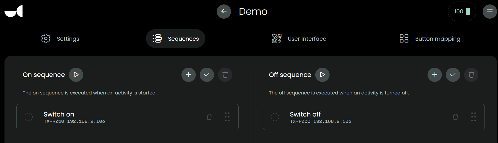

## Installation and usage

### Installation

- Make sure your AVR is ON or STANDBY.
- Go to the `Releases` section

  

- Download `Latest` `uc-intg-onkyo-avr-x.y.z.tar.gz` from the `Assets` section.

  

- In webconfigurator, go to `Integrations`, `Add new`, `Install custom`, select the `uc-intg-onkyo-avr-x.y.z.tar.gz` and then `Upload`.
- Uploading can take a few seconds.
- In `Integrations` select `Onkyo AVR custom` and click `next`.
- Select the `configure` option and click `next`.
- For the next step, it depends on your AVR model if it supports autodiscover, if it does:
  - Leave the input fields `AVR Model` and `AVR IP Address` empty.
- If auto discover fails:
  - Remove the integration completely, upload it again and then after upload:
  - Populate `AVR Model` and `AVR IP Address`.
- Check if the endpoint for Album Art corresponds with your AVR model, if it does not have an Album Art endpoint, set it to `na` to prevent errors.
- Configure also the other settings for your AVR.
- Click `Next`.
- Click `Add all`, click `Done`.
- If you have stored a backup of a previous *integration configuration*, you can restore is like described [here](./backup-restore.md).

### Available entities
  _next to the AVR entity, the integration also creates several [sensors](./sensor.md) and [selects](./select.md), you can decide for yourself if you also want to use these sensors, to control your AVR you only have to select the AVR entity_

  **the AVR entity has the🎵icon**

  

  

### Usage

- In webconfigurator, go to `Activities & macros`
- Add new Activity
- Give it a name, `Next`, Select your AVR, `Done`
- In the new Activity, `Sequences`, assign the corresponding commands to the `On sequence` and `Off sequence`

  

- In the new Activity, `Button mapping`, assign some buttons: `mute`, `volume up/down`, `channel up/down`
- Also available: `settings`, `cursor left right up down enter` and `home` to go back one level in the settings menu, `settings` you could assign to to the (hamburger) `menu` physical button on the remote and `home` you could for example assign to the `record` physical button next to it.

[back to main README](../README.md#installation-and-usage)
