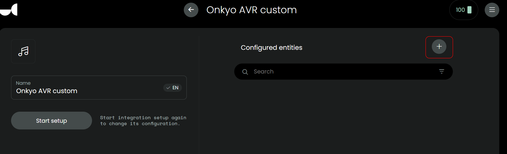

## Installation and usage

[back to main README](../README.md#installation-and-usage)

### Installation

- Make sure your AVR is ON or STANDBY.
- Download `uc-intg-onkyo-avr-x.x.x.tar.gz` from this page.
- In webconfigurator, go to `Integrations`, `Add new`, `Install custom`, select the `uc-intg-onkyo-avr-x.x.x.tar.gz` and then `Upload`.
- Uploading can take a few seconds.
- For the next step, it depends on your AVR model if it supports autodiscover, if it does:
  - In `Integrations` select `Onkyo AVR custom`.
  - Leave the input fields `AVR Model` and `AVR IP Address` empty.
  - Check if the endpoint for Album Art corresponds with your AVR model, if it does not have an Album Art endpoint, set it to `na` to prevent errors.
  - Click `Next`, click `Done`.
- If auto discover fails, remove the integration completely, upload it again and then after upload:
  - In `Integrations` select `Onkyo AVR custom`.
  - Populate `AVR Model` and `AVR IP Address`.
  - Check if the endpoint for Album Art corresponds with your AVR model, if it does not have an Album Art endpoint, set it to `na` to prevent errors.
  - Click `Next`, click `Done`.
- Add your AVR as entity: In `Integrations` select `Onkyo AVR custom`, click the `+` next to `Configured entities`, add your AVR

  

  

### Usage

- In webconfigurator, go to `Activities & macros`
- Add new Activity
- Give it a name, `Next`, Select your AVR, `Done`
- In the new Activity, `Sequences`, assign the corresponding commands to the `On sequence` and `Off sequence`

  

- In the new Activity, `Button mapping`, assign some buttons: `mute`, `volume up/down`, `channel up/down`
- Also available: `settings`, `cursor left right up down enter` and `home` to go back one level in the settings menu, `settings` you could assign to to the (hamburger) `menu` physical button on the remote and `home` you could for example assign to the `record` physical button next to it.

[back to main README](../README.md#installation-and-usage)
