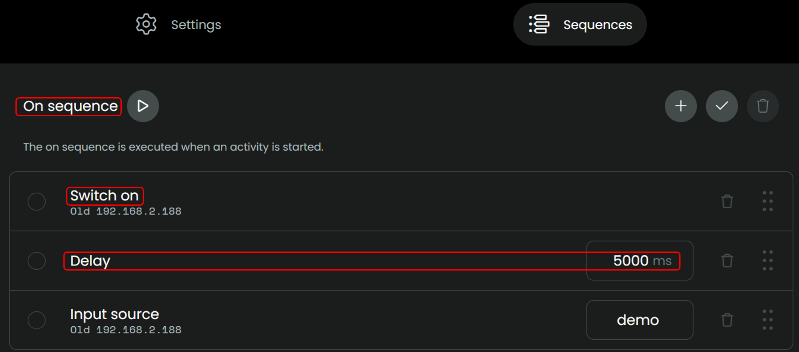
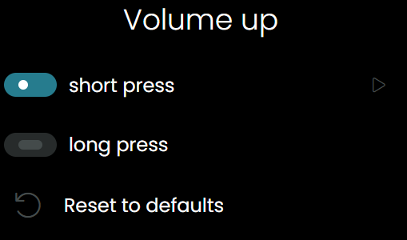
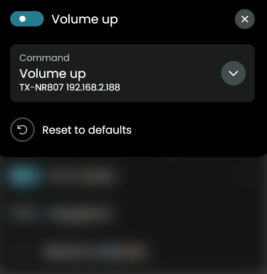

## Known issues and solutions

### In case of issues during the 'on requence' of an Activity

Some AVR models temporarily disconnect when powering on, in that case the next command that the Remote tries to send ends up in an error or time out because the Remote cannot re-connect yet. If you encounter that kind of issue, add a delay step between the Switch ON and the next AVR command of approximately 5 seconds, then lower it and try again to find the sweet spot:

### In case the AVR overshoots on long-press

When you long-press a button, for example volume up, and the AVR overshoots then increase the `Message queue Threshold` in the setup step of this integration. The setup step can be run again and again by selecting the integration in de webconfigurator of the Remote.

Just assign the volume command to the short-press in webconfigurator, **don't** assign to long-press.

[back to main README](../README.md#known-issues-and-solutions)
