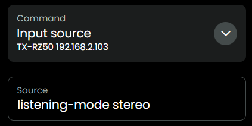
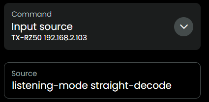

## Listening modes

Like descibed in the Cheats section, you can send a lot of different commands which are all mentioned in the [JSON](../src/eiscp-commands.ts) file.

Probably you have your AVR set to automatically select the best listening mode, but sometimes you might want to set a favorite mode, see the listening-mode section in the [JSON](../src/eiscp-commands.ts), for the correct command. A few examples from that JSON:

| Listening mode                      | value in `Input source`                            |
| ----------------------------------- | -------------------------------------------------- |
| Stereo                              | listening-mode stereo                              |
| Straight Decode                     | listening-mode straight-decode                     |
| Neo:6/Neo:X THX Cinema              | listening-mode thx-cinema                          |
| Neo:6 Cinema DTS Surround Sensation | listening-mode neo-6-cinema-dts-surround-sensation |

## What about `Dolby Atmos`, `DTS:X`, `Auro-3D`, `IMAX Enhanced`?

eISCP codes for Atmos, DTS:X, Auro-3D, and IMAX Enhanced are not standardized and may vary by receiver model and firmware.

However, most models `auto-select` the correct mode when the input signal is `Dolby Atmos`, `DTS:X`, `Auro-3D`, `IMAX Enhanced` and the listening mode is set to `Straight Decode`.

| Listening mode | value in `Input source`        |
| -------------- | ------------------------------ |
| Dolby Atmos    | listening-mode straight-decode |
| DTS:X          | listening-mode straight-decode |
| Auro-3D        | listening-mode straight-decode |
| IMAX Enhanced  | listening-mode straight-decode |

## Select widget
As from version 0.8.0, the integration offers a `select` widget for listening modes, see [this doc](select-listening-mode.md). 

Different models sometimes use different names for a single listening mode, You can use that functionality to quickly discover which listening modes are accepted by your AVR model.

## Example of known Pioneer listening modes
| Listening modes known to be accepted by Pioneer |
|-------------------------------------------------|
| direct                                          |
| dolby-surround                                  |
| dolby-surround-classical                        |
| dolby-surround-drama                            |
| dolby-surround-entertainment-show               |
| dolby-surround-front-stage-surround             |
| dolby-surround-sports                           |
| dolby-surround-unplugged                        |
| dts-neural:x                                    |
| extended-mono                                   |
| extended-stereo                                 |
| mono                                            |
| pure-direct                                     |
| stereo                                          |

[back to main README](../README.md#listening-modes)
