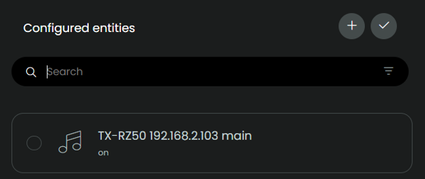
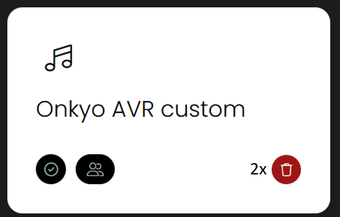

## Install new version

As from v0.8.0 the integration offers the option to backup and restore the configuration. To create a backup of the *integration configuration* see [this page](backup-restore.md).

Version 0.8.0 is compatible with [Integration Manager](https://github.com/JackJPowell/uc-intg-manager). If you don't use that Integration Manager, continue reading here. 

## Installing a new version directly within the web configurator
Installing a new version by using the web configurator is done by removing the current version. **As long as you make sure that during setup of the new version the selected AVR has the exact name and IP as in the current version, all your mappings in your activities will be preserved.**
If your AVR was autodiscovered, the name will be the same when you let it be autodiscovered again, as long as the IP address stays the same.

1. create a backup of the *remote*

   

2. download the tar.gz of the new version
3. configurator: remember the name of the selected entity

   

4. configurator: delete the integration _twice_, **the old integration must not be visible anymore in the Integrations overview**

   

5. upload the new version (see [installation procedure](./installation.md#installation))
6. in the new version, **start setup** and make sure that the selected AVR entity has the exact same name as in the previous version (see step 3)
7. done!

[Migrate from pre-v.0.7.0 to v.0.7.0+](v070-migration.md)

[back to main README](../README.md#install-new-version)
