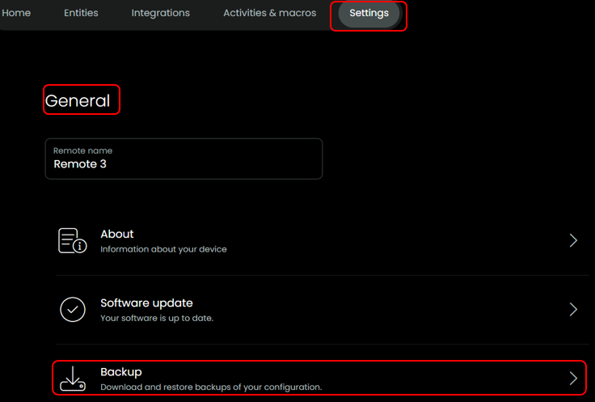
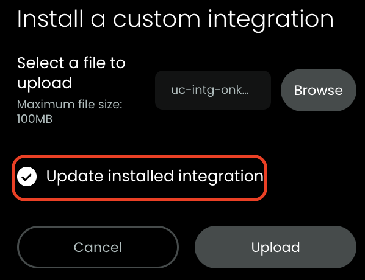

## Install new version

Version 0.8.0 and higher is compatible with [Integration Manager](https://github.com/JackJPowell/uc-intg-manager). If you don't use that Integration Manager, continue reading here.

## Installing a new version

1. create a backup of the _integration configuration_ see [this page](backup-restore.md)

2. create a backup of the _remote_

   

3. download the tar.gz of the new version

4. configurator: Integrations > Add new > Install custom

5. select `Update installed integration`

6. click `Browse` and select the newly downloaded tar.gs of step 2

   

7. click `Upload`, wait a few seconds, done!

[Migrate from pre-v.0.7.0 to v.0.7.0+](v070-migration.md)
