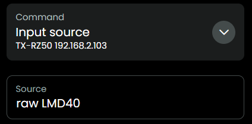

## Raw messages

This integration aims to use human readable commands, like `listening-mode straight-decode`. But let's say you have figured out a command for your AVR that does not exist yet in the [JSON](../src/eiscp-commands.ts), then you can try to send it in raw format:

Please let me know in [Discord](https://discord.com/channels/553671366411288576/1405962064521855127) what commands you have found, I will try to add them to this integration.

[back to main README](../README.md#raw-messages)
