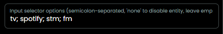

# Select Input Selector

As from v0.8.1 this integration offers a 'select' entity for [Input Selector](./input-selector.md).

This entity will offer a drop down of all Input Selector options (for example `tv`, `spotify`, `stm`, `dvd`).

As the list of all known options is very long, you can configure which options you want to have in the selection.

### Customizing the `input-selector` select

- You can configure a per‑AVR custom list of listening modes during setup.
- During manual setup provide a semicolon-separated list in the **Input selector options** field, for example:

  `tv; spotify; stm; fm; video3`

  

- Behavior:
  - If you provide a list, the `input-selector` select-entity will show *only* those options for that AVR.
  - If you leave the field empty the driver continues to use the complete list with all possible options for all AVR models.
  - If you enter `none` the select-entity will not be created.
  - The configured list is saved, included in backups, and persists across reboots.

[back to Listening modes](./input-selector.md)

[back to main README](../README.md#input-source)