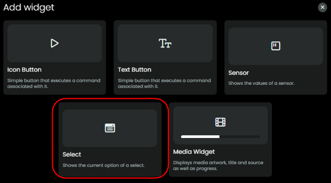
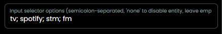

# Select Input Selector

As from v0.8.1 this integration offers a 'select' entity for [Input Selector](./input-selector.md).

This entity will offer a drop down of all Input Selector options (for example `tv`, `spotify`, `stm`, `dvd`).

As the list of all known options is very long, you can configure which options you want to have in the selection.

### `Input source list: Auto (default) / Manual`

During setup you can choose where the list of inputs comes from:

- **`Auto` (default)**: the integration asks your AVR for its inputs (using the `avr-info` / NRI protocol) and shows exactly the inputs your AVR reports, using the names it shows for them. The list is rebuilt every time you save the setup, so renaming an input on the AVR is reflected after the next save.
- **`Manual`**: the integration uses the list you configure yourself (see below).

Auto works for every configured zone of an AVR, because the inputs belong to the AVR itself. All collected inputs are offered on every zone, sorted alphabetically.

Notes:

- Auto needs an AVR that supports the NRI protocol. If the AVR does not report any input, the setting is switched back to `Manual` and the log explains why.
- Placeholder entries are skipped: an AVR that adds an entry named `Source` to its input list does not get that entry as an option.
- The collected list is only kept in memory; only the `Auto`/`Manual` setting is saved and backed up.
- A custom list from **Input selector options** is only used in `Manual` mode. In `Auto` mode the reported inputs take precedence.

### Customizing the `input-selector` select

- You can configure a per‑AVR custom list of listening modes during setup.
- During manual setup provide a semicolon-separated list in the **Input selector options** field, for example:

  `tv; spotify; stm; fm; video3`

  

- Behavior:
  - If you provide a list, the `input-selector` select-entity will show _only_ those options for that AVR
  - If you set it to `all` the driver continues to use the complete list with all possible options for all AVR models.
  - If you enter `none` the select-entity will not be created (**none-to-other or other-to-none needs a reboot**)
  - The configured list is saved, included in backups, and persists across reboots.

_note: this impacts both `input-selector` and the list of `Input source` in Web Configurator!_

[How this selector impacts the Remote](./source-webconfigurator-mediawidget.md)
