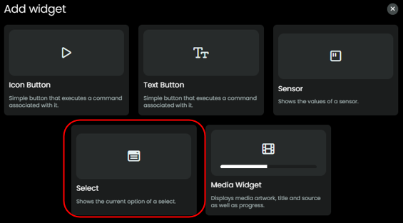
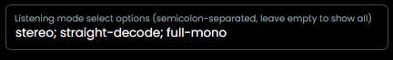

# Select Listening Mode

As from v0.8.0 this integration offers a 'select' entity for [Listening Mode](./listening-modes.md).

This entity will offer a drop down of all Listening Modes (for example `stereo`, `straight-decode`, `tv-logic`).

As the list of all known options is very long and the AVR does not return a dynamic list of valid options for the playing source, the integration tries to shorten the list of options based on the audio-input format but the end result is still a (too?) long list of options. So, as an alternative you can configure which options you want to have in the selection.

### Customizing the `listening-mode` select

- You can configure a per‑AVR custom list of listening modes during setup.
- During manual setup provide a semicolon-separated list in the **Listening mode select options** field, for example:

  `stereo; straight-decode; neural-thx; full-mono`

  

- Behavior:
  - If you provide a list, the `listening-mode` select-entity will show *only* those options for that AVR regardless of the current source/activity.
  - If you leave the field empty the driver continues to use the dynamic, audio-format filtered list.
  - If you enter `none` the select-entity will not be created.
  - The configured list is saved, included in backups, and persists across reboots.

[back to Listening modes](./listening-modes.md)

[back to main README](../README.md#listening-modes)