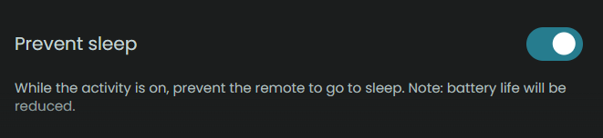
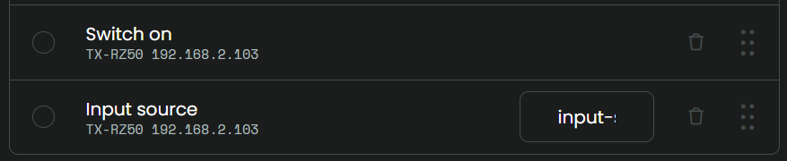
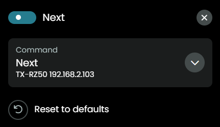

## Spotify

Let's say that you select the AVR in the Spotify app on your phone and your AVR switches source to Spotify, the remote will sense that and will try to collect the album art, artist, title and album. All this is collected from the AVR, this integration does not communicate with Spotify directly. Also `play/pause`, `next` and `previous` will be send to the AVR, the AVR will handle the communicatio with your Spotify app.

It's best to create an activity for Spotify and select it when you have send music to your AVR. Next time you select this activity and hit `play` it will try to continue where you left it last time.

In future releases of Unfolded Circle, one activity could activate another activity. When that is possible this integration will be adjusted to automatically switch to the Spotify activity once it detects that the AVR switched to streaming Spotify.

### Spotify activity

To set up an Activity for Spotify, have a look at these screenshots:

- Create activity and prevent sleep

  

- On sequence, Input source: `input-selector net`

  

- User inerface, add mediawidget for the AVR with maximum size

  

- Button mapping, map to the buttons you prefer (for example previous/next can be mapped to channel up/down):
  - volume up/down
  - play/pause
  - previous/next
  - mute

    

Previous/Next on the remote will only work if you can also use previous/next directly in your Spotify app, that depends on the subscription you have for Spotify.

_note: after installing a new version of the integration or after a reboot of the remote, it might be needed to close screen on the remote and enter the already active activity again to get the MediaWidget to work, hit next to go to the next song and trigger refresh of the album art_

[back to main README](../README.md#example-activities)
