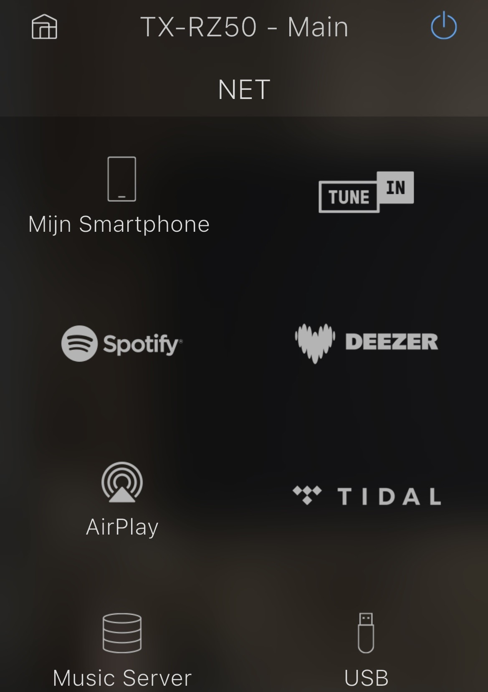
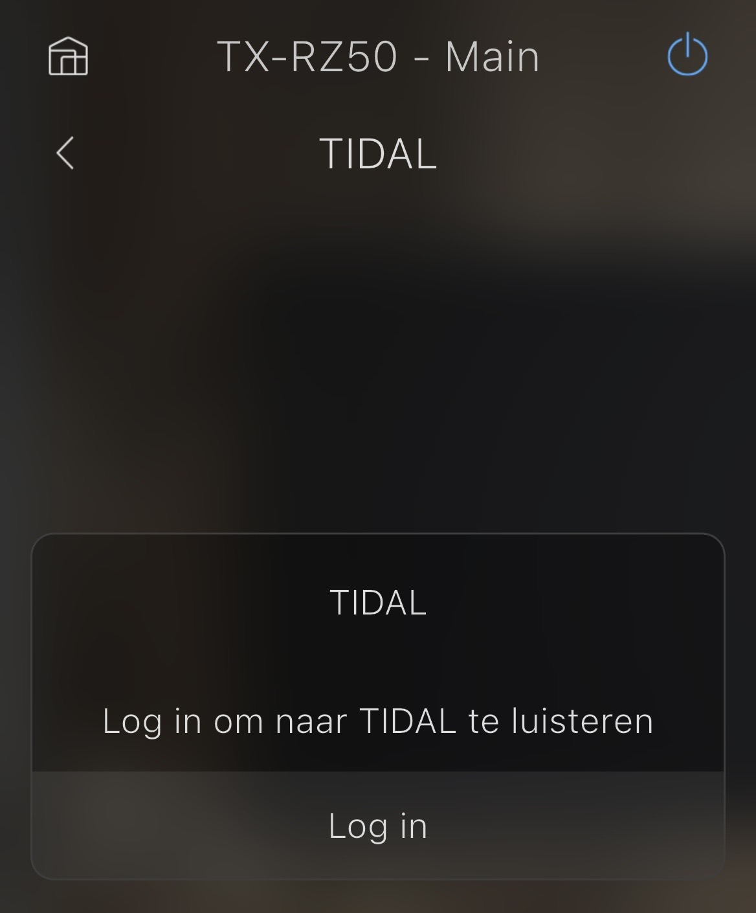
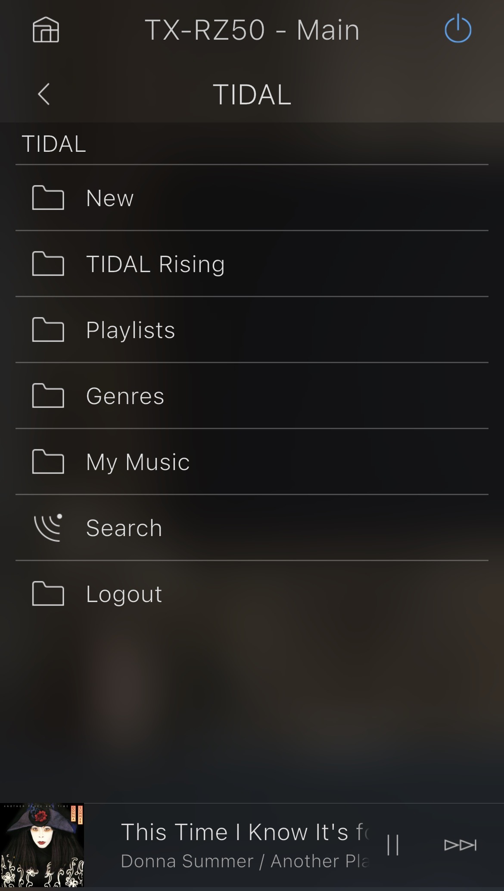
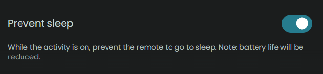
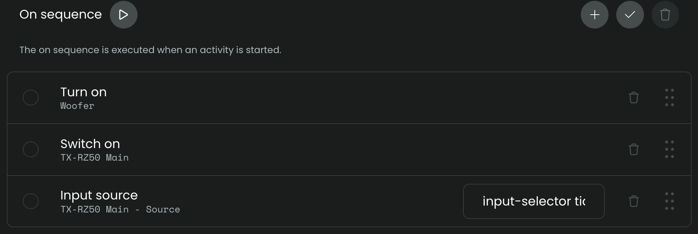
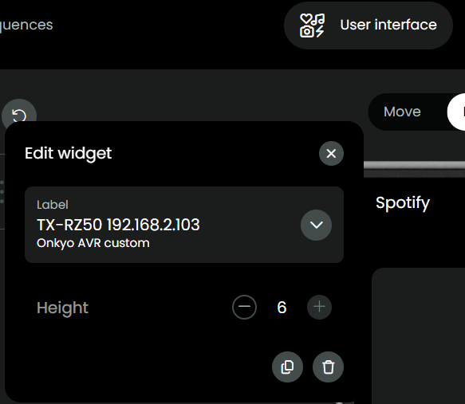
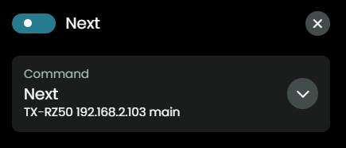

## Tidal

As your AVR can logon to Tidal with your account, the integration can be used to browse to the Tidal menu.

This integration will try to collect the album art, artist, title and album. All this is collected from the AVR, this integration does not communicate with Tidal directly. All commands, like `browse`, `play/pause`, `next` and `previous`, will be send to the AVR, the AVR will handle the communication with the Tidal service.

### Prerequisite: Add your Tidal account to the AVR

Use the _Controller app of your AVR_ to logon to Tidal, these examples are of the Onkyo Controller App and a TX-RZ50:
- select source: NET
- select subsource: Tidal

  

- logon with your Tidal credentials

  

- now you can browse the Tidal menu in the Controller app

  

### Tidal activity

To set up an Activity for Tidal, have a look at these screenshots:

- Create activity and prevent sleep

  

- On sequence, Input source: `input-selector tidal`

  

- User interface, add mediawidget for the AVR with maximum size

  

- Button mapping: map to the buttons you prefer (for example previous/next can be mapped to channel up/down):
  - volume up/down
  - play/pause
  - previous/next
  - mute

    

Commands on the remote will only work if you can also use those commands directly in your Tidal app, that depends on the subscription you have for Tidal.

### Browse Tidal

The mediabrowser of Unfolded Circle combined with your AVR being logged on to the Tidal service make it possibe to scroll through the Tidal menu just like you would do with the Controller app of your AVR. Some screenshots:

- s1
- s2
- s3

### Note
If `input-selector tidal` does not work, check the manual of your AVR to see if Tidal is even available as selectable input on the AVR:

- your AVR _does_ have a Tidal input: run setup of this integration again and increase the value for 'NET sub-source selection delay'
- your AVR does _not_ have a Tidal input, just try `input-selector net`, see [input-selector](./input-selector.md#net) for more info

[back to main README](../README.md#installation-and-usage)
