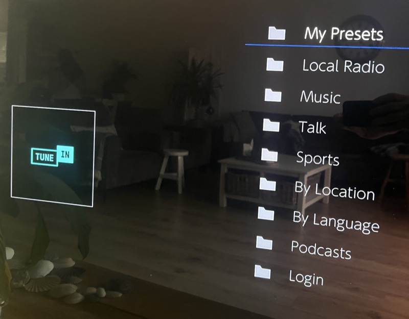
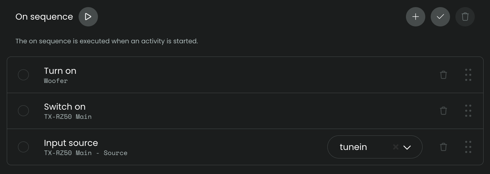
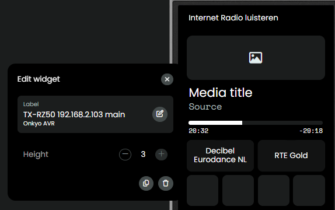
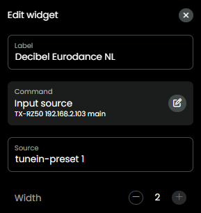
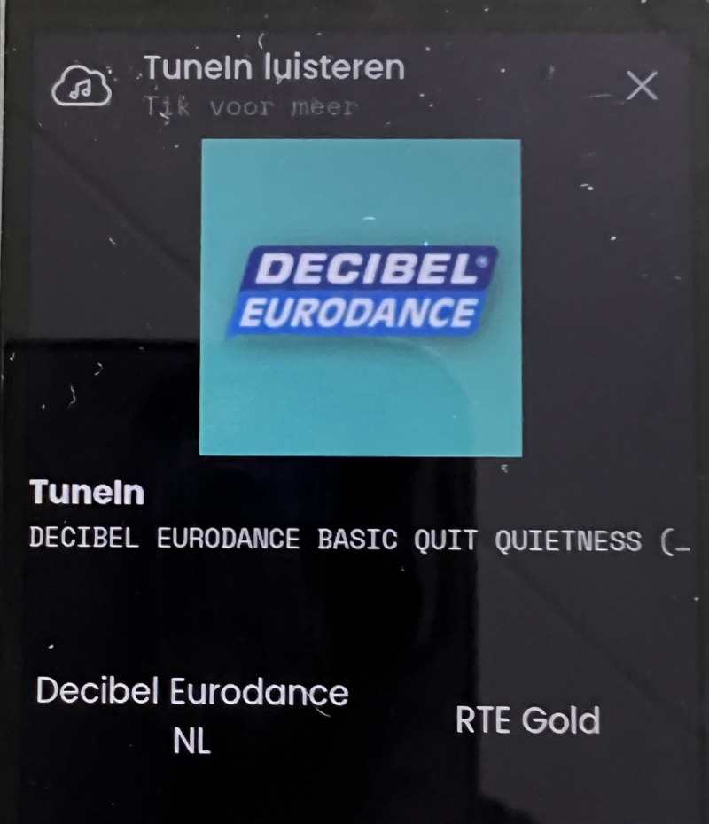

## TuneIn

As of v0.8.1 this integration supports selecting presets for TuneIn (only applicable if your AVR can select TuneIn presets). The integration does not communicate with TuneIn, it communicates with your AVR, your AVR deals with communication with the TuneIn service.

As there is no EISCP command known for selecting a TuneIn preset directly, this integration runs an internal macro which navigates the TuneIn menu of the AVR. In general, when selecting TuneIn as source on the AVR, 'My Presets' is the first option in the menu:

If in your case 'My Presets' is on a different position in the AVR TuneIn menu, start setup and set the configuration to the correct position in the list:

### TuneIn activity

To set up an Activity for TuneIn, have a look at these screenshots:

- Create activity and prevent sleep

  

- On sequence, Input source: `input-selector tunein`

  

- Map the volume up/down physical buttons (do _not_ map volume long press, **only map volume short press**).

- Also map the [Slider](./volume.md#slider) to control the volume

- You might also want the map the `Info` function to one of the physical buttons to be able to trigger a refresh of the song data in case you think it did not refresh automatically.

- User interface, add mediawidget for the AVR

  

- User interface, add buttons for the presets known by the AVR: `tunein-preset x`, the x is the position of a specific station on your Preset list.

  

  **Note: `tunein-preset` only works when AVR already has selected TuneIn as source**

- Now, when you select your TuneIn activity and then select one of your presets on the screen of your remote, the integration will select that TuneIn preset and play it, **as the integration needs to navigate the TuneIn menu, it needs a few seconds before the station starts playing**

  

- If selecting preset is not always working, consider running setup again and set `NET sub source selection delay` to a higher value.

  

### Media Browser

If your UC Remote is running firmware v2.9.1 or higher, the mediawidget supports media browsing! This integration (v0.8.5+) offers browsing of the 'My Presets' list to easily select a different TuneIn station:

This integration (v0.8.10+) can be configured to browse the TuneIn menu, instead of just showing the My Presets.

**When you want to go back in menu options, it's best to use `TuneIn Main Menu` or `Back` at the top of the options, the back button in the Media Browser itself does not yet set the AVR state one step back in menu navigation so you could get into unexpected behavior using the back option of the Media Browser.**
