# Update from v0.6.5 or lower to v0.7.0 or higher

Normally when you install a new version, as long as you kept the AVR name and IP the same as the previous version, all mappings in your activities keep on working.

Version v0.7.0 however has two changes compared to lower versions which break the mappings in your activities, but with running a **one-time extra setup step**, you can get the integration to repair the already existing activities which use AVR entities created with v0.6.5 or lower.

## Breaking changes

The two breaking changes are:
- v0.7.0 offers new functionality which enables you to control the zones in your AVR, this changes the AVR entity name
- correcting the interal integration ID: I made a mistake here in v0.0.1 which gets fixed in version v.0.7.0 because I wanted to offer an easy fix for breaking the entity name anyway

## Detailed step-by-step guide

Kudos to [Albaintor](https://github.com/albaintor/UC-Remote-Two-Toolkit) for creating an awesome toolkit! I added a manupilated part of Albaintor's code to this integration to make the below stuff possible, my aim is to make the update to v0.7.0 as smooth as possible. 

I have performed this several times (by installing backup and v0.6.5 and then updating again) and it worked fine every time. I also used the new entities a couple of days including reboots of the remote and it worked as expected with just one remark: when you have configured multilpe zones for your AVR(s), the integration needs more time to recover after a reboot of the remote compared with just having one zone.

So it is working fine fore me but please be aware that ⚠️ You use this integration at your own risk! ⚠️

My setup:
- UC Remote 3, beta firmware v2.7.0
- Onkyo TX-RZ50, wired connection with fixed IP
- Onkyo custom integration version v0.6.5

1. create a backup of the remote before you start making changes

    

2. remember the name of the selected entities in integration v0.6.5 (for example 'TZ-RZ50 192.168.2.103' or 'TX-NR807 192.168.2.188')

    *notice that no zone is mentioned in the original entity name, the space between model and IP is added automatically*

    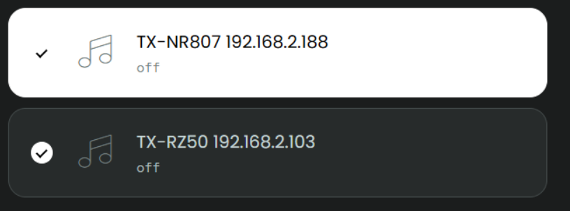

2. delete integration v0.6.5 twice so it is not showing anymore

    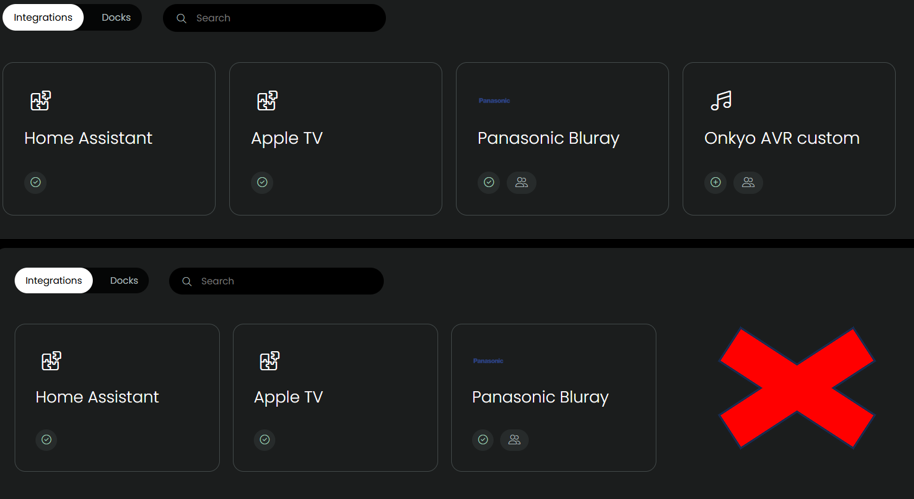

3. install Onkyo custom integration v0.7.0, **start setup**, if not making use of auto-discovery make sure that the selected AVR entity has the exact same name and IP as in the previous version (see step 2). You can already set multiple zones if you need it, most users just need 1 zone. 

    **Do *not* enter zone information yourself!**

    Auto-discovery

    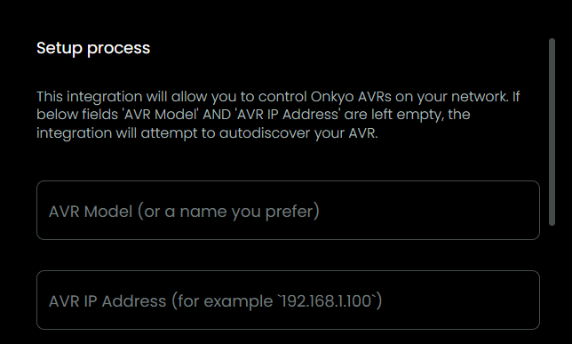

    Manual setup

    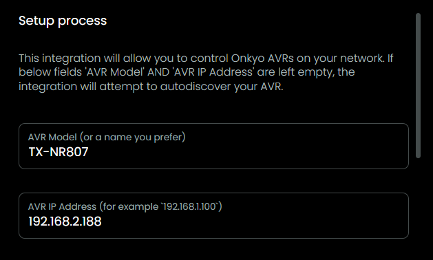

4. have a close look at the configured entities, you see their name is now not only Model+IP anymore but Model+IP+zone
    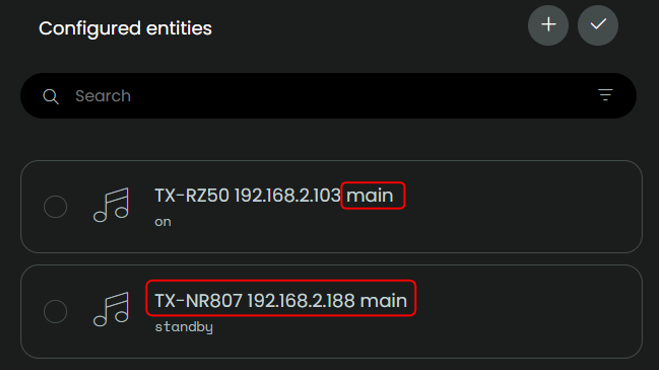

5. because of the changed id of the integration and the changed id of the AVR entities, the mappings in your activities will be broken

    TZ-RZ50 192.168.2.103

    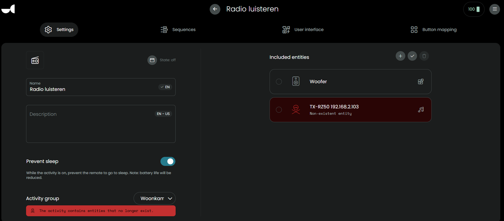

    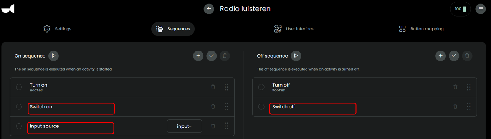

    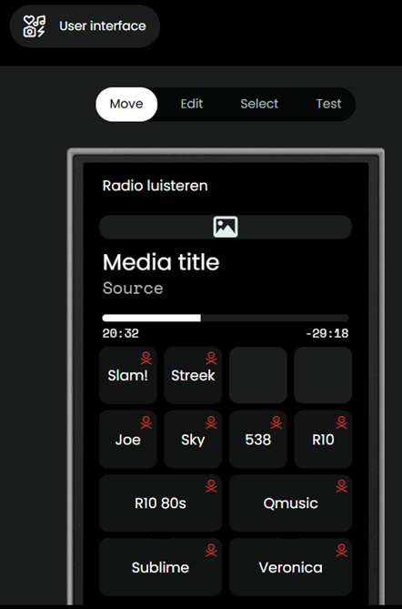

    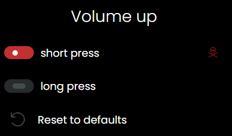

    TX-NR807 192.168.2.188

    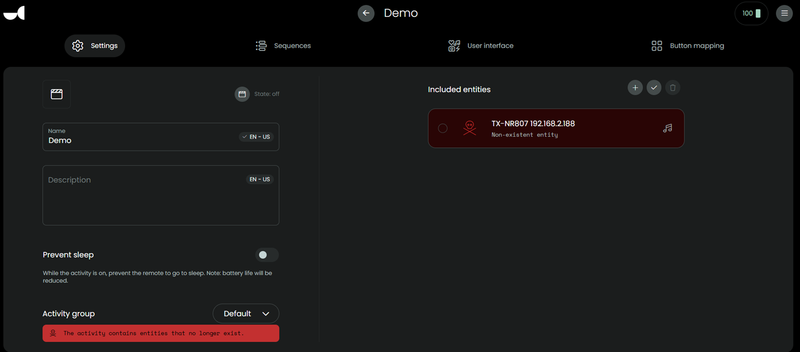

6. Onkyo custom integration v0.7.0, **start setup again**, dont touch AVR settings but scroll down to the bottom, enter the pincode which you use to login to the web configurator of your remote and click `next`

    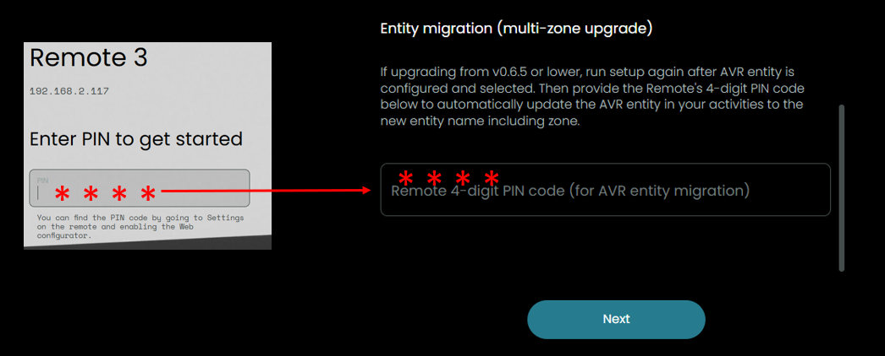

7. give it some time, the integration will check all your activities and if it finds entries which are based on the old integration-id and old entity name (without zone) it will try to update it to the new situation. Do not add any changes in name or IP yourself, the integration will only be able to process the changes which are enforced by v0.7.0.

    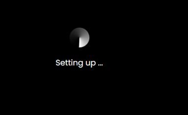

8. after the setup completed, check your activities again, you should see the new AVR entities being applied

    TZ-RZ50 192.168.2.103

    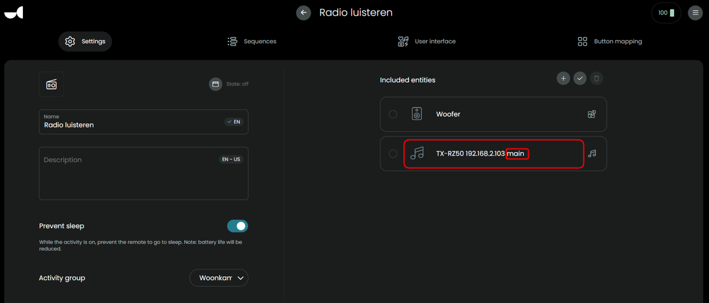

    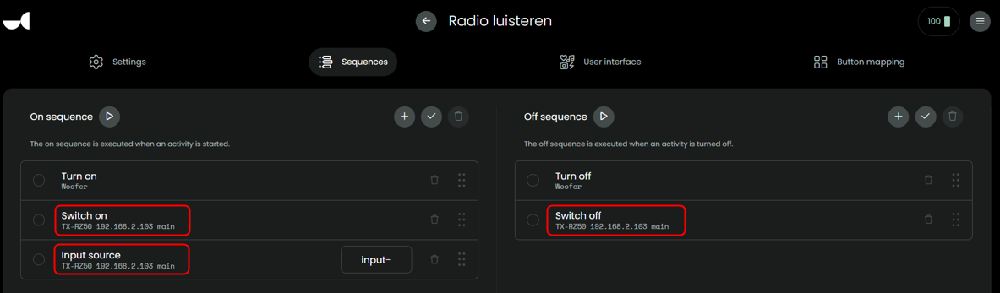

    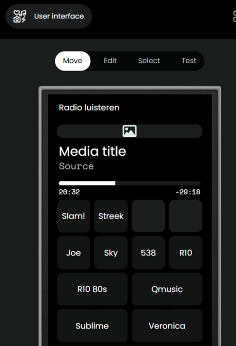

    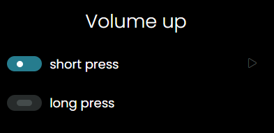

    TX-NR807 192.168.2.188

    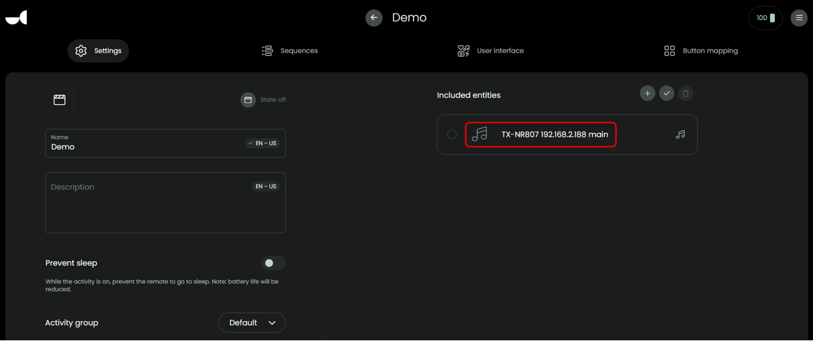

9. this was a one-time action, you are all set to continue using the Onkyo custom integration and are ready for any new versions that will be released in the future!

10. [more info about using zones here](./multiple-zones.md)

## Updated failed?
If the update failed for some reason, best it to go back to the last working state:
- [collect logs](collect-logs.md)
- delete integration v0.7.0 twice so it is now showing anymore
- restore the backup you created in step 1 and reboot the remote
- install integration version v0.6.5
- run setup, keep name and IP of the AVR the same is it was in step 2
- select your AVR as configured entity

## Alternatives to solve the broken mappings
- Manual fix: If you prefer to fix your mappings manually, its a matter of adding the new AVR entity in the activity and then replace all old AVR mappings with the new entity.
- Use [the tool created by Albaintor](https://github.com/albaintor/UC-Remote-Two-Toolkit) yourself to get all mappings corrected.
