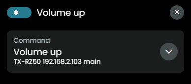
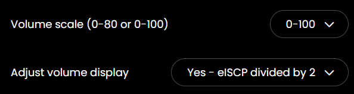
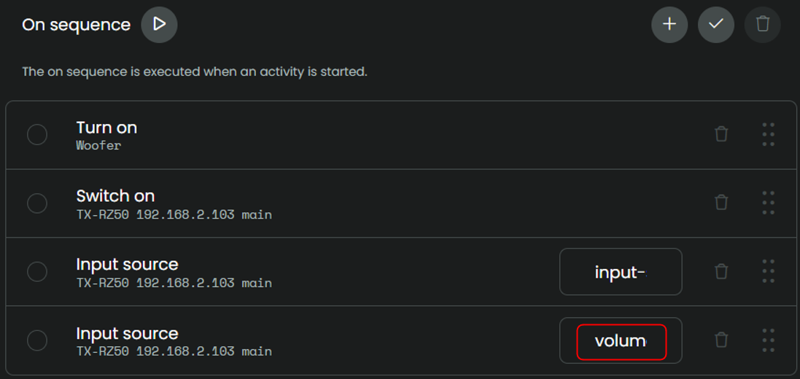
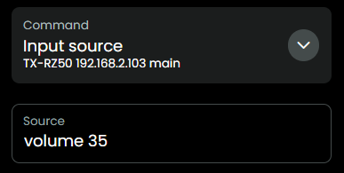
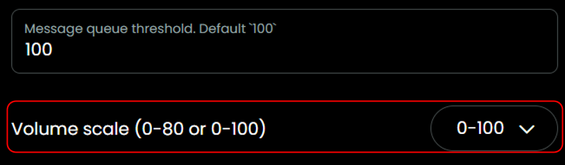
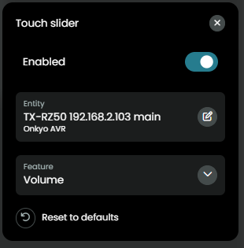
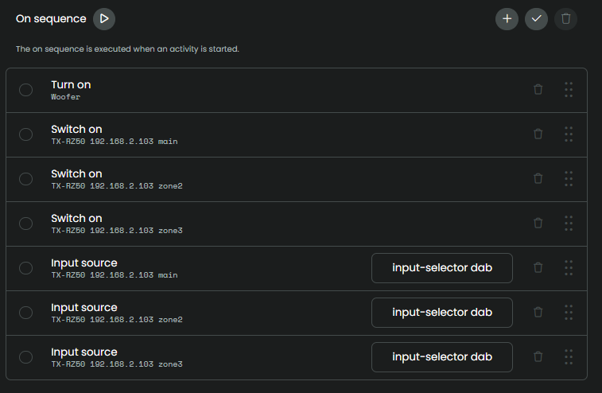
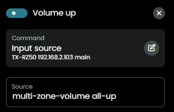
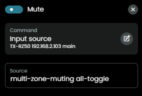

## Volume

### Map the volume button

With a single zone action, you just map the VolumeUp/Down command of that selected AVR entity to the volume (assign to **short press** only!):

### Volume Steps

Currently the volume level that is shown on the display of the remote can only show integer values (1, 15, 60, ...) and not yet x.5 values (1.5, 15.5, 60.5, ...). When you assign `Volume up` or `Volume down` commands to a button, the volume step will be 1.0, this is done so the volume level that is shown on the display of the remote is the same as the level showing on the AVR.

You can however send 0.5 steps by cheating with the `Input source`, select that as command for the volume button and then as `source` enter `volume level-up` or `volume level-down`. See the [Cheats section](cheats.md) for other examples. When you decide to use 0.5 volume steps, the value shown by the remote will be a bit off compared to the level shown by the AVR when the level is at x.5

When the remote itself can show 0.5 steps in the future, I will add something like a ‘volumeUp0.5’ to the list of commands

### Relative / Absolute

The AVR itself may display the volume as dB (relative) or as an absolute number, depending on its settings, but the eISCP protocol only accepts and returns the absolute value. There is no command to set the volume directly in dB via eISCP.

This integration can calculate the dB value based on the absolute value, you can configure this during setup:

- `Absolute (1-100)` (default): volume sensor values are shown as absolute numbers.
- `Relative (dB)`: volume sensor values are shown as dB values computed from the absolute value 

This setting only changes how volume is displayed; volume control commands still use eISCP absolute values. 

There is a trade off: *when you configure the integration to work with dB, you cannot use the slider yet*.

### Volume Encoding in eISCP:

The volume command uses a range of 0-200 to represent volume levels from 0.0 to 100.0 in 0.5 steps. Why This Design?

- AVR Precision: Many Onkyo/Integra/Pioneer receivers can be configured to adjust volume in 0.5 dB increments for finer control.
- Protocol Flexibility: Using 0-200 range allows the protocol to handle both 0.5 dB and 1 dB step configurations with a single integer-based command.
- Backward Compatibility: The protocol can support different AVR models with different volume ranges and step sizes.

Some models show the value as is on their display, some models show the values divided by 2, some models let you select between the two options.

To be able to align the value on the remote to match the value that is showing on the display of your AVR, during setup you can select wether the value needs to be adjusted

When the EISCP protocol sends `40`, your AVR display may show `20`, this setting makes sure that you can let the value that is showing on the remote match the value that is showing on the display of your AVR.

### Set specific level

Most models allow to set a standard volume level per input source. For example when you select DAB, the volume is set to 35. If your model does not support that you can use the Unfolded Remote and this integration to set the volume to a specific level by adding a command in the on-sequence of an activity or as a button on the user interface with the simple command `volume 35` (or whatever level you like of course):

When you determine the specific setting for your use-case, consider [Volume Encoding in eISCP](#volume-encoding-in-eiscp): if you want to set the level to 30 (AVR display) then you probably need to set a value of 60.

### Slider

Note: **currently you can only use the slider to control the volume when you have configured the integration to work with absolute values instead of relative**.

As from v0.6.1, this integration supports the use of the Slider to control the AVR volume. Make sure that during the setup step of the integration, you select the correct `Volume scale` to get the best experience. See the manual of your AVR model for detailed information.

In the Activity, `Button mapping`, click the `Touch slider`, select your Onkyo AVR as `Entity`, and Volume as `Feature`.

Now you can control the AVR volume with the Slider.

### Multi Zone Volume

As from v0.8.3 this integration supports controlling the volume for multiple zones with just a single command. Let's assume you have an activity that uses multiple zones:

Then in that activity you can use the `multi-zone-volume all-up` command (assign to **short press** only!):

Lookup `multi-zone-volume` in the [JSON](../src/eiscp-commands.ts) to see the available options, for example `zone2-zone3-up` to adjust zones2 and 3 but not the main zone. The command `multi-zone-volume all-up`controls the volume on all _configured_ zones.

_Note: multi-zone-volume does **not** support the use of the slider._

### Multi Zone Mute

As from v0.8.3 this integration supports controlling muting for multiple zones with just a single command.

Assign `multi-zone-muting all-toggle` to the muting button to mute all comfigured zones in one action:

Lookup `multi-zone-muting` in the [JSON](../src/eiscp-commands.ts) to see the available options, for example `zone2-zone3-toggle` to toggle zones2 and 3 but not the main zone.

[back to main README](../README.md#volume)
