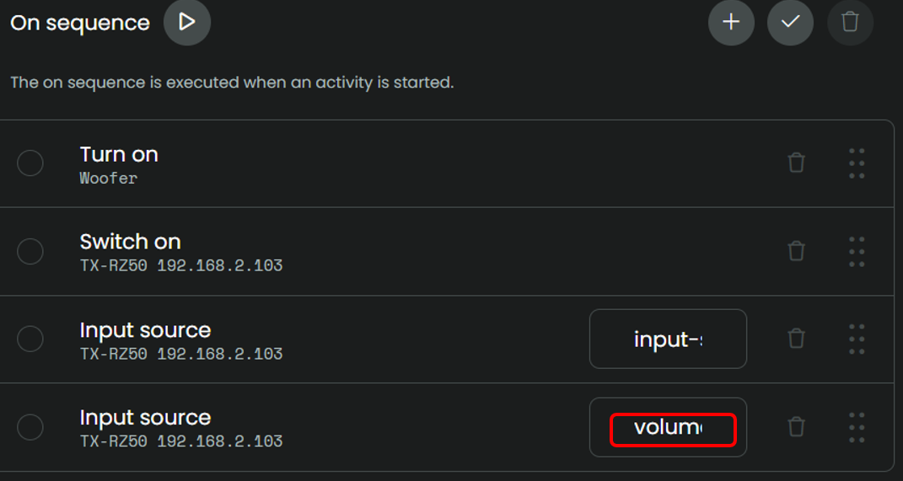
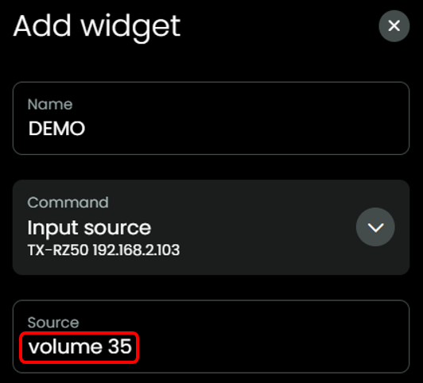

## Volume

### Relative / Absolute

The AVR itself may display the volume as dB (relative) or as an absolute number, depending on its settings, but the eISCP protocol only accepts and returns the absolute value. There is no command to set the volume directly in dB via eISCP.

### Volume Encoding in eISCP:

The volume command uses a range of 0-200 to represent volume levels from 0.0 to 100.0 in 0.5 steps. Why This Design?
- AVR Precision: Many Onkyo/Integra receivers can be configured to adjust volume in 0.5 dB increments for finer control.
- Protocol Flexibility: Using 0-200 range allows the protocol to handle both 0.5 dB and 1 dB step configurations with a single integer-based command.
- Backward Compatibility: The protocol can support different AVR models with different volume ranges and step sizes.

Some models show the value as is on their display, some models show the values divided by 2, some models let you select between the two options.

To be able to align the value on the remote to match the value that is showing on the display of your AVR, during setup you can select wether the value needs to be adjusted

When the EISCP protocol sends `40`, your AVR display may show `20`, this setting makes sure that you can let the value that is showing on the remote match the value that is showing on the display of your AVR.

### Set specific level

Most models allow to set a standard volume level per input source. For example when you select DAB, the volume is set to 35. If your model does not support that you can use the Unfolded Remote and this integration to set the volume to a specific level by adding a command in the on-sequence of an activity or as a button on the user interface with the simple command `volume 35` (or whatever level you like of course):

When you determine the specific setting for your use-case, consider [Volume Encoding in eISCP](#volume-encoding-in-eiscp): if you want to set the level to 30 (AVR display) then you probably need to set a value of 60.

### Slider

As from v0.6.1, this integration support the use of the Slider to control the AVR volume. Make sure that during the setup step of the integration, you select the correct `Volume scale` to get the best experience. See the manual of your AVR model for detailed information.

The integration will deal with [Volume Encoding in eISCP](#volume-encoding-in-eiscp) in this case.

In the Activity, User interface, add a `Media Widget` for your Onkyo AVR and you can then control the volume with the slider.

If you already have a Media Widget in that activity for a different device, let's say an AppleTV, just add a new widget for your AVR. The slider will work if the Media Widget for the AVR last Media Widget on that page. In other words the Media Widget that is closest to the Slider on the remote.

Now you can control the AVR volume with the Slider.

[back to main README](../README.md#volume)
